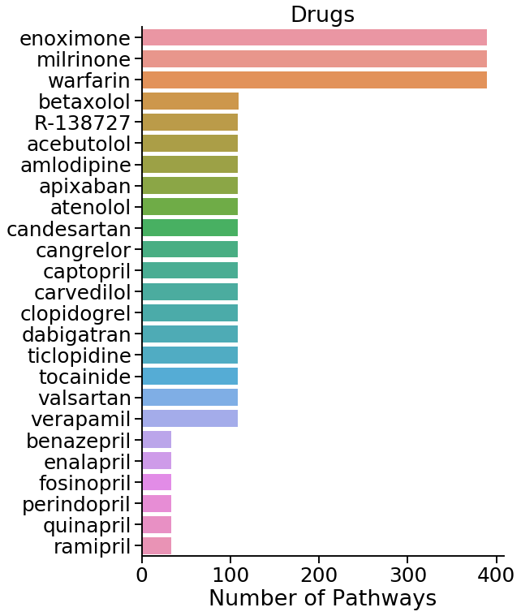
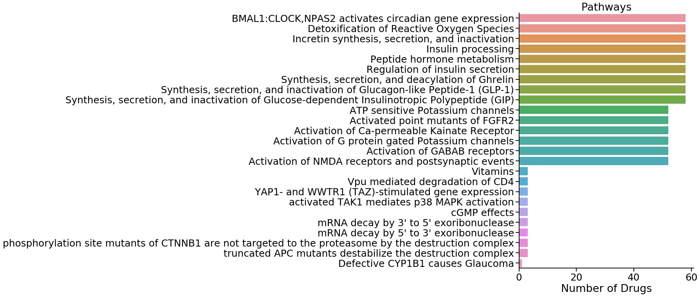

# Drug/Chemical Reactome Pathways

---
Samir Akre - October 2019


```python
import neo4j_functions.driver as neo4j_driver
import pandas as pd
import importlib
import progressbar
import seaborn as sns
import matplotlib.pyplot as plt
```

## Importing curated lists of drugs and chemicals


```python
chemical_list_df = pd.read_csv('lib/Oxidative Stress Text Mining Targets 4.1 - Summary of Oxidative Stress.csv')
drug_list_df = pd.read_csv('lib/Drug list total 04.05.19   - Overview Drug list.csv')
```


```python
chemical_list_df.head(n=2)
```


<div>
<style scoped>
    .dataframe tbody tr th:only-of-type {
        vertical-align: middle;
    }

    .dataframe tbody tr th {
        vertical-align: top;
    }

    .dataframe thead th {
        text-align: right;
    }
</style>
<table border="1" class="dataframe">
  <thead>
    <tr style="text-align: right;">
      <th></th>
      <th>Biological Events of Oxidative Stress</th>
      <th>Molecular and Functional Categories</th>
      <th>Molecule/Enzyme/Protein</th>
      <th>MeSH Heading</th>
      <th>MeSH Supplementary</th>
      <th>MeSH tree numbers</th>
      <th>Chemical Formula</th>
      <th>Examples</th>
      <th>Pharm Actions</th>
      <th>Tree Numbers</th>
      <th>References</th>
    </tr>
  </thead>
  <tbody>
    <tr>
      <td>0</td>
      <td>Initiation of Oxidative  1</td>
      <td>Reactive Oxygen Species (ROS)</td>
      <td>Superoxide (anion radical)</td>
      <td>Superoxides</td>
      <td>NaN</td>
      <td>D01.248.497.158.685.750.850; D01.339.431.374.8...</td>
      <td>O2-</td>
      <td>Superoxide, Hydrogen Peroxide</td>
      <td>Oxidants</td>
      <td>D27.720.642,\nD27.888.569.540</td>
      <td>PMID: 25547488</td>
    </tr>
    <tr>
      <td>1</td>
      <td>2</td>
      <td>NaN</td>
      <td>Hydrogen Peroxide</td>
      <td>Hydrogen Peroxide</td>
      <td>NaN</td>
      <td>D01.248.497.158.685.750.424; D01.339.431.374.4...</td>
      <td>H2O2</td>
      <td>NaN</td>
      <td>Anti-Infective Agents, Local</td>
      <td>D27.505.954.122.187</td>
      <td>NaN</td>
    </tr>
  </tbody>
</table>
</div>


```python
drug_list_df.head(n=2)
```


<div>
<style scoped>
    .dataframe tbody tr th:only-of-type {
        vertical-align: middle;
    }

    .dataframe tbody tr th {
        vertical-align: top;
    }

    .dataframe thead th {
        text-align: right;
    }
</style>
<table border="1" class="dataframe">
  <thead>
    <tr style="text-align: right;">
      <th></th>
      <th>Drug Category</th>
      <th>#</th>
      <th>Name</th>
      <th>Synonyms</th>
      <th>MeSH Descriptor</th>
      <th>MeSH tree(s)</th>
      <th>Common adverse effects</th>
      <th>Dosage (freq/amount/time/delivery)</th>
      <th>Duration (time)</th>
      <th>Pham Action</th>
    </tr>
  </thead>
  <tbody>
    <tr>
      <td>0</td>
      <td>Anticoagulants</td>
      <td>1</td>
      <td>heparin</td>
      <td>['Calciparine', 'Eparina', 'heparina', 'Hepari...</td>
      <td>heparin</td>
      <td>D09.698.373.400</td>
      <td>Thrombocytopenia, Cerebral haemorrhage, Haemog...</td>
      <td>1/18U/kg/iv</td>
      <td>2 days</td>
      <td>Anticoagulants, \nFibrinolytic Agents</td>
    </tr>
    <tr>
      <td>1</td>
      <td>NaN</td>
      <td>2</td>
      <td>warfarin</td>
      <td>['4-Hydroxy-3-(3-oxo-1-phenylbutyl)coumarin', ...</td>
      <td>warfarin</td>
      <td>D03.383.663.283.446.520.914\nD03.633.100.150.4...</td>
      <td>Haemorrhage, Haematoma, anaemia, Epistaxis, hy...</td>
      <td>1/2-10mg/day/po</td>
      <td>As needed</td>
      <td>Anticoagulants, \nRodenticides</td>
    </tr>
  </tbody>
</table>
</div>


## Looking for reactome ids of drugs in curated list
Looks for the lower case name of the drug from the curated list to match any of the lowercase names a drug in reactome is listed in.  

 - Outputs pandas data frame under variable `drugs_in_reactome`
 - 58/155 drugs found to have counter parts in reactome


```python
importlib.reload(neo4j_driver)
driver = neo4j_driver.driver(uri = "bolt://localhost:7687", user = "neo4j", password = "Akre1234")
```

### Test to see if I can find any drug in the reactome data set


```python
driver.search_item_in_array(
    array_field="name",
    item='"herceptin"',
    class_type='Drug',
    info_cols = ['displayName', 'stId', 'isInDisease'],
    verbose=True
)
```

    Query: 
     MATCH (a:Drug) WHERE toLower("herceptin") IN [x in a.name | toLower(x)] RETURN a.displayName, a.stId, a.isInDisease 


<div>
<style scoped>
    .dataframe tbody tr th:only-of-type {
        vertical-align: middle;
    }

    .dataframe tbody tr th {
        vertical-align: top;
    }

    .dataframe thead th {
        text-align: right;
    }
</style>
<table border="1" class="dataframe">
  <thead>
    <tr style="text-align: right;">
      <th></th>
      <th>displayName</th>
      <th>stId</th>
      <th>isInDisease</th>
    </tr>
  </thead>
  <tbody>
    <tr>
      <td>0</td>
      <td>trastuzumab [extracellular region]</td>
      <td>R-ALL-9634466</td>
      <td>True</td>
    </tr>
  </tbody>
</table>
</div>


### Querying to find reactome ID for each drug in curated list


```python
drugs_in_reactome = pd.DataFrame()
for drug_name in drug_list_df.Name.unique():
    result = driver.search_item_in_array(
        array_field="name",
        item='"%s"' % drug_name,
        class_type='Drug',
        info_cols = ['displayName', 'stId', 'isInDisease']
    )
    result['Name'] = drug_name
    drugs_in_reactome = drugs_in_reactome.append(result)
drugs_in_reactome.head()
```


<div>
<style scoped>
    .dataframe tbody tr th:only-of-type {
        vertical-align: middle;
    }

    .dataframe tbody tr th {
        vertical-align: top;
    }

    .dataframe thead th {
        text-align: right;
    }
</style>
<table border="1" class="dataframe">
  <thead>
    <tr style="text-align: right;">
      <th></th>
      <th>displayName</th>
      <th>stId</th>
      <th>isInDisease</th>
      <th>Name</th>
    </tr>
  </thead>
  <tbody>
    <tr>
      <td>0</td>
      <td>warfarin [cytosol]</td>
      <td>R-ALL-9014945</td>
      <td>True</td>
      <td>warfarin</td>
    </tr>
    <tr>
      <td>0</td>
      <td>dabigatran [extracellular region]</td>
      <td>R-ALL-9015346</td>
      <td>True</td>
      <td>dabigatran</td>
    </tr>
    <tr>
      <td>0</td>
      <td>rivaroxaban [extracellular region]</td>
      <td>R-ALL-9015055</td>
      <td>True</td>
      <td>rivaroxaban</td>
    </tr>
    <tr>
      <td>0</td>
      <td>apixaban [extracellular region]</td>
      <td>R-ALL-9038732</td>
      <td>True</td>
      <td>apixaban</td>
    </tr>
    <tr>
      <td>0</td>
      <td>edoxaban [extracellular region]</td>
      <td>R-ALL-9038742</td>
      <td>True</td>
      <td>edoxaban</td>
    </tr>
  </tbody>
</table>
</div>


```python
print('Initial Drug List Size: ', drug_list_df.Name.nunique())
print('Drugs found in Reacome: ', drugs_in_reactome.Name.nunique())

```

    Initial Drug List Size:  155
    Drugs found in Reacome:  58


## Looking for pathways associated with each drug found in the Reactome database

- Looks for 25 "nearest" pathways marked as `Pathways` to any drug within 1-3 nodes
- Outputs to `pathways` variable as a pandas dataframe


```python

# Re-initializing driver to account for changes made to driver function
importlib.reload(neo4j_driver)
driver = neo4j_driver.driver(uri = "bolt://localhost:7687", user = "neo4j", password = "Akre1234")

# For each reactome drug ID, looks for 100 "closest" pathways within 1-2 nodes 
pathways = pd.DataFrame()
for reactome_id, d_df, in progressbar.progressbar(drugs_in_reactome.groupby('stId')):
    result = driver.get_n_relations(
        class_1='Drug',
        id_1="'%s'" % reactome_id,
        id_class='stId',
#        class_2='TopLevelPathway',
        class_2='Pathway',
        info_cols=['a.displayName', 'b.displayName', 'b.speciesName'],
        edge_type='*1..2',
        where_clause=" WHERE b.speciesName = 'Homo sapiens'",
        verbose=False,
        n=10000,
    ).rename(columns={
        'a.displayName': 'Drug',
        'b.displayName': 'Pathway',
        'b.speciesName': 'Species'
    })
    pathways = pathways.append(result, ignore_index=True, sort=False)

pathways.head()
```

    100% (58 of 58) |########################| Elapsed Time: 0:00:15 Time:  0:00:15


<div>
<style scoped>
    .dataframe tbody tr th:only-of-type {
        vertical-align: middle;
    }

    .dataframe tbody tr th {
        vertical-align: top;
    }

    .dataframe thead th {
        text-align: right;
    }
</style>
<table border="1" class="dataframe">
  <thead>
    <tr style="text-align: right;">
      <th></th>
      <th>Drug</th>
      <th>Pathway</th>
      <th>Species</th>
      <th>edgeLength</th>
    </tr>
  </thead>
  <tbody>
    <tr>
      <td>0</td>
      <td>warfarin [cytosol]</td>
      <td>Chaperone Mediated Autophagy</td>
      <td>Homo sapiens</td>
      <td>2.0</td>
    </tr>
    <tr>
      <td>1</td>
      <td>warfarin [cytosol]</td>
      <td>Pink/Parkin Mediated Mitophagy</td>
      <td>Homo sapiens</td>
      <td>2.0</td>
    </tr>
    <tr>
      <td>2</td>
      <td>warfarin [cytosol]</td>
      <td>Receptor Mediated Mitophagy</td>
      <td>Homo sapiens</td>
      <td>2.0</td>
    </tr>
    <tr>
      <td>3</td>
      <td>warfarin [cytosol]</td>
      <td>Microautophagy</td>
      <td>Homo sapiens</td>
      <td>2.0</td>
    </tr>
    <tr>
      <td>4</td>
      <td>warfarin [cytosol]</td>
      <td>Amplification  of signal from unattached  kine...</td>
      <td>Homo sapiens</td>
      <td>2.0</td>
    </tr>
  </tbody>
</table>
</div>


```python
pathways['drug'] = pathways['Drug'].str.split(' ').str.get(0)
```


```python
# Number of drugs per pathway, seperated by edgelength
drugs_per_pathway = pd.DataFrame(pathways.groupby(['Pathway', 'edgeLength']).drug.nunique()).reset_index().sort_values(by=['edgeLength', 'drug'], ascending=[True, False])
```


```python
# Number of pathways per drug, seperated by edgeLength
pathways_per_drug = pd.DataFrame(pathways.groupby(['drug', 'edgeLength']).Pathway.nunique()).reset_index().sort_values(by=['edgeLength', 'Pathway'], ascending=[True, False])
```


```python
# Plotting top 15 and bottom 10 drugs
sns.set_context('talk', font_scale=1.5)
fig, ax = plt.subplots(figsize=(8, 12))
sns.countplot(
    y='drug',
    order=pd.concat([pathways_per_drug.head(15), pathways_per_drug.tail(10)]).drug,
    data=pathways,
    ax=ax
)
ax.set_xlabel('Number of Pathways')
ax.set_ylabel('')
ax.set_title('Drugs')

sns.despine()
```





```python
# Plotting top 15 and bottom 10 pathways

sns.set_context('talk', font_scale=1.5)
fig, ax = plt.subplots(figsize=(8, 12))
sns.countplot(
    y='Pathway',
    order=pd.concat([drugs_per_pathway.head(15), drugs_per_pathway.tail(10)]).Pathway,
    data=pathways,
    ax=ax
)
ax.set_xlabel('Number of Drugs')
ax.set_ylabel('')
ax.set_title('Pathways')

sns.despine()
```





## Test Cypher Queries in custom neo4j driver implementation


```python
driver.get_node_info(
    id_field="stId",
    id_val="R-ALL-9634956",
    class_type='Drug',
    info_cols = ['displayName', 'name', 'isInDisease']
)
```

    Query: 
     MATCH (a:Drug {stId: $idnum}) RETURN a.displayName, a.name, a.isInDisease 
    pyridostigmine [extracellular region]
    ['pyridostigmine']
    True


<div>
<style scoped>
    .dataframe tbody tr th:only-of-type {
        vertical-align: middle;
    }

    .dataframe tbody tr th {
        vertical-align: top;
    }

    .dataframe thead th {
        text-align: right;
    }
</style>
<table border="1" class="dataframe">
  <thead>
    <tr style="text-align: right;">
      <th></th>
      <th>displayName</th>
      <th>name</th>
      <th>isInDisease</th>
    </tr>
  </thead>
  <tbody>
    <tr>
      <td>0</td>
      <td>pyridostigmine [extracellular region]</td>
      <td>[pyridostigmine]</td>
      <td>True</td>
    </tr>
  </tbody>
</table>
</div>


```python
driver.get_n_nodes_info(
    class_type='Drug',
    info_cols = ['displayName', 'name', 'isInDisease'],
    n=10
)
```

    Query: 
     MATCH (a:Drug) RETURN a.displayName, a.name, a.isInDisease LIMIT 10


<div>
<style scoped>
    .dataframe tbody tr th:only-of-type {
        vertical-align: middle;
    }

    .dataframe tbody tr th {
        vertical-align: top;
    }

    .dataframe thead th {
        text-align: right;
    }
</style>
<table border="1" class="dataframe">
  <thead>
    <tr style="text-align: right;">
      <th></th>
      <th>displayName</th>
      <th>name</th>
      <th>isInDisease</th>
    </tr>
  </thead>
  <tbody>
    <tr>
      <td>0</td>
      <td>trastuzumab [extracellular region]</td>
      <td>[trastuzumab, herceptin, D5v8, R-597]</td>
      <td>True</td>
    </tr>
    <tr>
      <td>0</td>
      <td>CP-724714 [cytosol]</td>
      <td>[CP-724714]</td>
      <td>True</td>
    </tr>
    <tr>
      <td>0</td>
      <td>Afatinib [cytosol]</td>
      <td>[Afatinib, BIBW2992, Irreversible TKI inhibito...</td>
      <td>True</td>
    </tr>
    <tr>
      <td>0</td>
      <td>AZ5104 [cytosol]</td>
      <td>[AZ5104]</td>
      <td>True</td>
    </tr>
    <tr>
      <td>0</td>
      <td>Sapitinib [cytosol]</td>
      <td>[Sapitinib]</td>
      <td>True</td>
    </tr>
    <tr>
      <td>0</td>
      <td>Tesevatinib [cytosol]</td>
      <td>[Tesevatinib, EXEL-7647, XL-647, KD-019, XL647]</td>
      <td>True</td>
    </tr>
    <tr>
      <td>0</td>
      <td>Lapatinib [cytosol]</td>
      <td>[Lapatinib, GW572016, Tykerb, Reversible tyros...</td>
      <td>True</td>
    </tr>
    <tr>
      <td>0</td>
      <td>Neratinib [cytosol]</td>
      <td>[Neratinib, HKI-272, afatinib, Irreversible ty...</td>
      <td>True</td>
    </tr>
    <tr>
      <td>0</td>
      <td>AEE788 [cytosol]</td>
      <td>[AEE788]</td>
      <td>True</td>
    </tr>
    <tr>
      <td>0</td>
      <td>Canertinib [cytosol]</td>
      <td>[Canertinib, CI-1033, Irreversible TKI inhibit...</td>
      <td>True</td>
    </tr>
  </tbody>
</table>
</div>


```python

```
