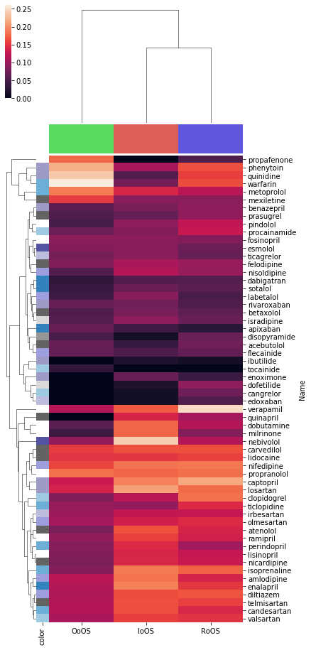
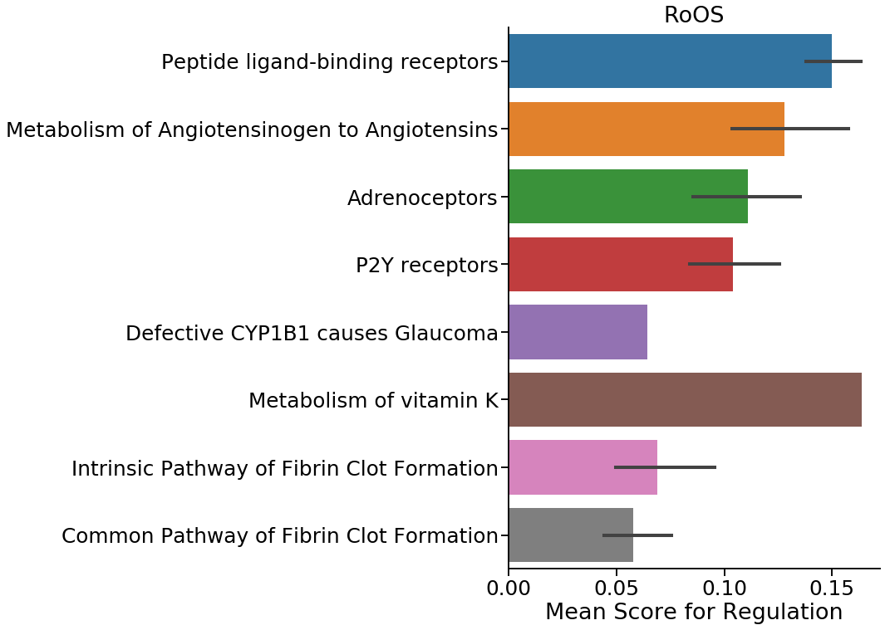
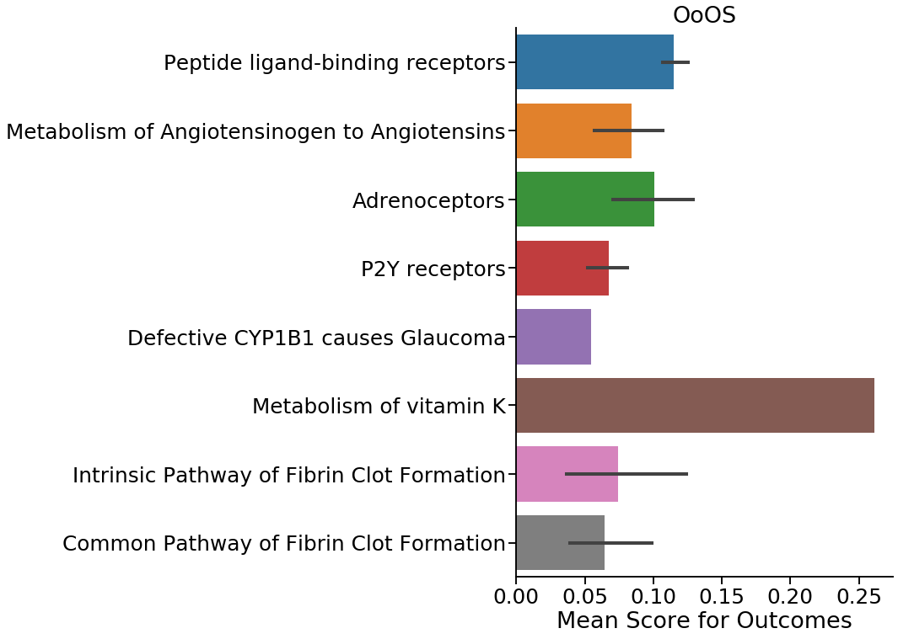
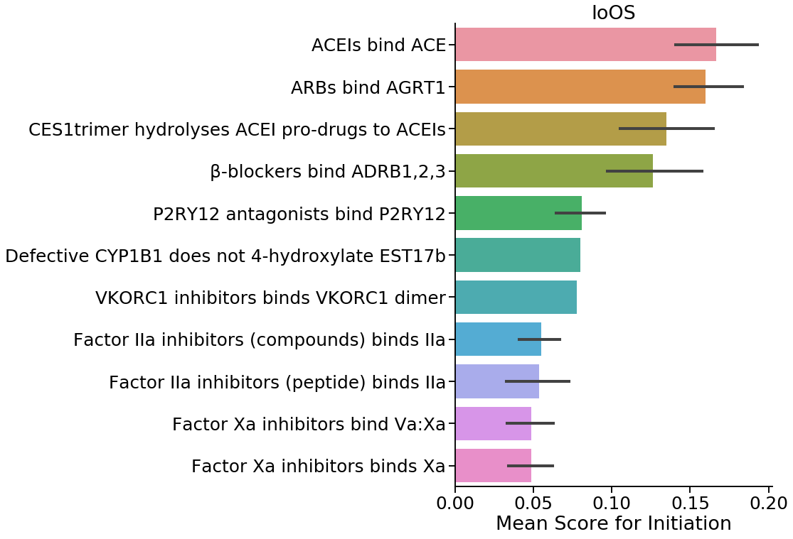
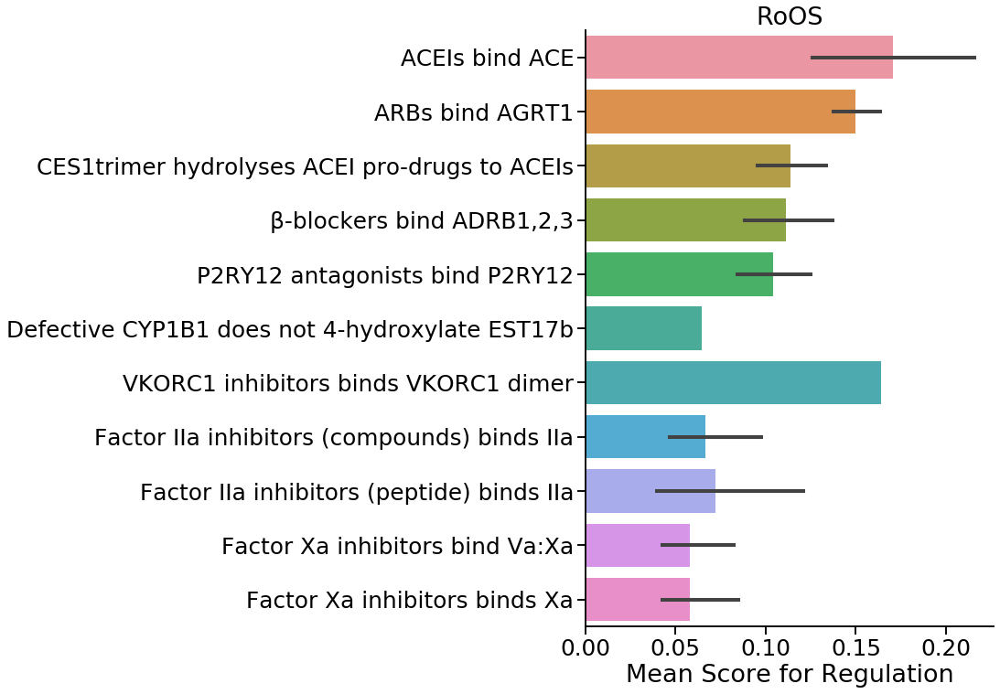
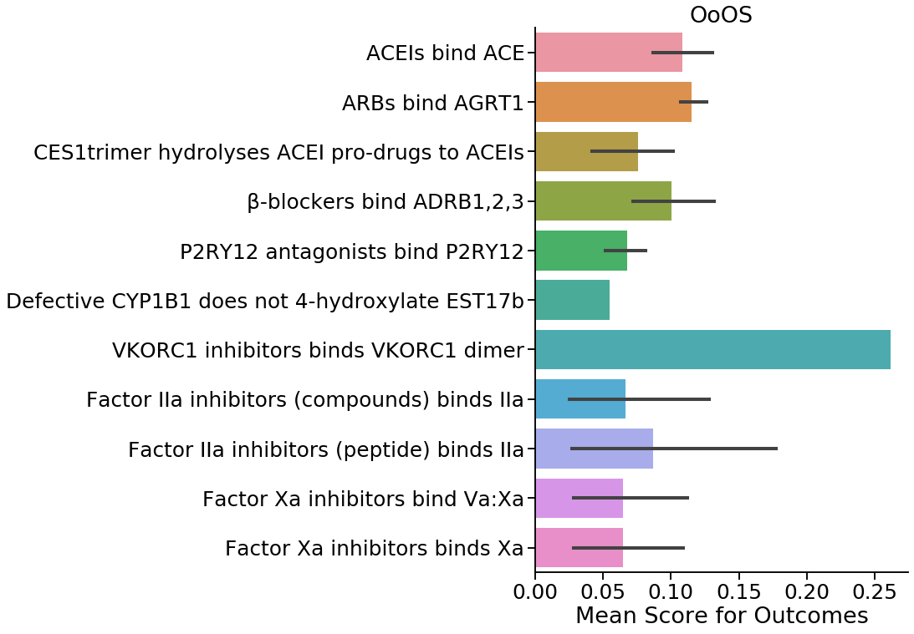
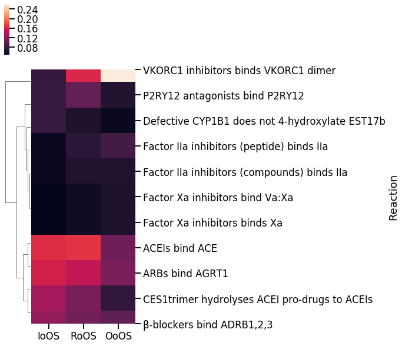
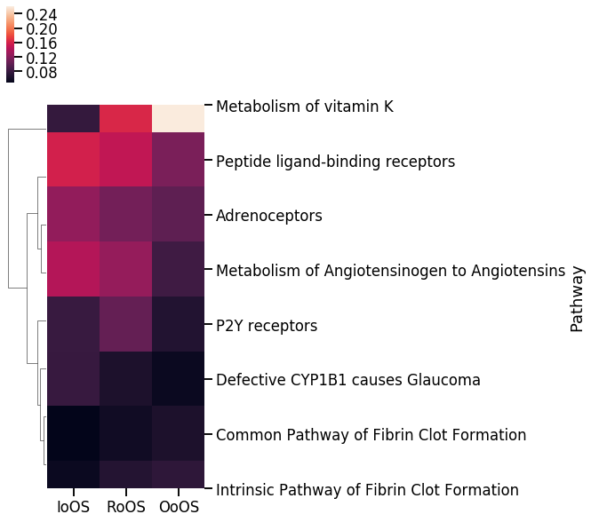

# CaseOLAP Score + Linking Drugs to Reactome Pathways

This notebook first tries to map drugs curated by Alex and David to entities in Reactome. Next these reactome entites are mapped to pathways and reactions. The caseolap score for drugs in a pathway are averaged and plotted.

---
Samir Akre - December 2019


```python
import neo4j_functions.driver as neo4j_driver
import pandas as pd
import importlib
import progressbar
import seaborn as sns
import matplotlib.pyplot as plt
```

## Importing curated lists of drugs and chemicals


```python
chemical_list_df = pd.read_csv('lib/oxidative_stress_chemicals_SA_10222019.csv')
drug_list_df = pd.read_csv('lib/drug_list_SA_10222019.csv')
```


```python
chemical_list_df.head(n=2)
```


<div>
<style scoped>
    .dataframe tbody tr th:only-of-type {
        vertical-align: middle;
    }

    .dataframe tbody tr th {
        vertical-align: top;
    }

    .dataframe thead th {
        text-align: right;
    }
</style>
<table border="1" class="dataframe">
  <thead>
    <tr style="text-align: right;">
      <th></th>
      <th>Biological Events of Oxidative Stress</th>
      <th>Molecular and Functional Categories</th>
      <th>Molecule/Enzyme/Protein</th>
      <th>MeSH Heading</th>
      <th>MeSH Supplementary</th>
      <th>MeSH tree numbers</th>
      <th>Chemical Formula</th>
      <th>Examples</th>
      <th>Pharm Actions</th>
      <th>Tree Numbers</th>
      <th>References</th>
    </tr>
  </thead>
  <tbody>
    <tr>
      <td>0</td>
      <td>Initiation of Oxidative</td>
      <td>Reactive Oxygen Species (ROS)</td>
      <td>Superoxide (anion radical)</td>
      <td>Superoxides</td>
      <td>NaN</td>
      <td>D01.248.497.158.685.750.850; D01.339.431.374.8...</td>
      <td>O2-</td>
      <td>Superoxide, Hydrogen Peroxide</td>
      <td>Oxidants</td>
      <td>D27.720.642,\nD27.888.569.540</td>
      <td>PMID: 25547488</td>
    </tr>
    <tr>
      <td>1</td>
      <td>Initiation of Oxidative</td>
      <td>Reactive Oxygen Species (ROS)</td>
      <td>Hydrogen Peroxide</td>
      <td>Hydrogen Peroxide</td>
      <td>NaN</td>
      <td>D01.248.497.158.685.750.424; D01.339.431.374.4...</td>
      <td>H2O2</td>
      <td>NaN</td>
      <td>Anti-Infective Agents, Local</td>
      <td>D27.505.954.122.187</td>
      <td>NaN</td>
    </tr>
  </tbody>
</table>
</div>


```python
drug_list_df.head(n=2)
```


<div>
<style scoped>
    .dataframe tbody tr th:only-of-type {
        vertical-align: middle;
    }

    .dataframe tbody tr th {
        vertical-align: top;
    }

    .dataframe thead th {
        text-align: right;
    }
</style>
<table border="1" class="dataframe">
  <thead>
    <tr style="text-align: right;">
      <th></th>
      <th>Drug Category</th>
      <th>#</th>
      <th>Name</th>
      <th>Synonyms</th>
      <th>MeSH Descriptor</th>
      <th>MeSH tree(s)</th>
      <th>Common adverse effects</th>
      <th>Dosage (freq/amount/time/delivery)</th>
      <th>Duration (time)</th>
      <th>Pharm Action</th>
      <th>...</th>
      <th>Unnamed: 1015</th>
      <th>Unnamed: 1016</th>
      <th>Unnamed: 1017</th>
      <th>Unnamed: 1018</th>
      <th>Unnamed: 1019</th>
      <th>Unnamed: 1020</th>
      <th>Unnamed: 1021</th>
      <th>Unnamed: 1022</th>
      <th>Unnamed: 1023</th>
      <th>Unnamed: 1024</th>
    </tr>
  </thead>
  <tbody>
    <tr>
      <td>0</td>
      <td>Anticoagulants</td>
      <td>1.0</td>
      <td>heparin</td>
      <td>['Calciparine', 'Eparina', 'heparina', 'Hepari...</td>
      <td>heparin</td>
      <td>D09.698.373.400</td>
      <td>Thrombocytopenia, Cerebral haemorrhage, Haemog...</td>
      <td>1/18U/kg/iv</td>
      <td>2 days</td>
      <td>Anticoagulants, \nFibrinolytic Agents</td>
      <td>...</td>
      <td>NaN</td>
      <td>NaN</td>
      <td>NaN</td>
      <td>NaN</td>
      <td>NaN</td>
      <td>NaN</td>
      <td>NaN</td>
      <td>NaN</td>
      <td>NaN</td>
      <td>NaN</td>
    </tr>
    <tr>
      <td>1</td>
      <td>Anticoagulants</td>
      <td>2.0</td>
      <td>warfarin</td>
      <td>['4-Hydroxy-3-(3-oxo-1-phenylbutyl)coumarin', ...</td>
      <td>warfarin</td>
      <td>D03.383.663.283.446.520.914\nD03.633.100.150.4...</td>
      <td>Haemorrhage, Haematoma, anaemia, Epistaxis, hy...</td>
      <td>1/2-10mg/day/po</td>
      <td>As needed</td>
      <td>Anticoagulants, \nRodenticides</td>
      <td>...</td>
      <td>NaN</td>
      <td>NaN</td>
      <td>NaN</td>
      <td>NaN</td>
      <td>NaN</td>
      <td>NaN</td>
      <td>NaN</td>
      <td>NaN</td>
      <td>NaN</td>
      <td>NaN</td>
    </tr>
  </tbody>
</table>
<p>2 rows × 1025 columns</p>
</div>


## Looking for reactome ids of drugs in curated list
Looks for the lower case name of the drug from the curated list to match any of the lowercase names a drug in reactome is listed in.  

 - Outputs pandas data frame under variable `drugs_in_reactome`
 - 58/155 drugs found to have counter parts in reactome


```python
importlib.reload(neo4j_driver)
reactome_driver = neo4j_driver.driver(uri = "bolt://localhost:7687", user = "neo4j", password = "Akre1234")
```

### Test to see if I can find any drug in the reactome data set


```python
reactome_driver.search_item_in_array(
    array_field="name",
    item='"herceptin"',
    class_type='Drug',
    info_cols = ['displayName', 'stId', 'isInDisease'],
    verbose=True
)
```

    Query: 
     MATCH (a:Drug) WHERE toLower("herceptin") IN [x in a.name | toLower(x)] RETURN a.displayName, a.stId, a.isInDisease 


<div>
<style scoped>
    .dataframe tbody tr th:only-of-type {
        vertical-align: middle;
    }

    .dataframe tbody tr th {
        vertical-align: top;
    }

    .dataframe thead th {
        text-align: right;
    }
</style>
<table border="1" class="dataframe">
  <thead>
    <tr style="text-align: right;">
      <th></th>
      <th>displayName</th>
      <th>stId</th>
      <th>isInDisease</th>
    </tr>
  </thead>
  <tbody>
    <tr>
      <td>0</td>
      <td>trastuzumab [extracellular region]</td>
      <td>R-ALL-9634466</td>
      <td>True</td>
    </tr>
  </tbody>
</table>
</div>


### Querying to find reactome ID for each drug in curated list
- TODO: Refine search criteria


```python
drugs_in_reactome = pd.DataFrame()
for (drug_name, drug_cat), _ in drug_list_df.groupby(['Name', 'Drug Category']):
    result = reactome_driver.search_item_in_array(
        array_field="name",
        item='"%s"' % drug_name,
        class_type='Drug',
        info_cols = ['displayName', 'stId', 'isInDisease']
    )
    result['Name'] = drug_name
    result['drug_cat'] = drug_cat.strip()
    drugs_in_reactome = drugs_in_reactome.append(result)
drugs_in_reactome.head()
```


<div>
<style scoped>
    .dataframe tbody tr th:only-of-type {
        vertical-align: middle;
    }

    .dataframe tbody tr th {
        vertical-align: top;
    }

    .dataframe thead th {
        text-align: right;
    }
</style>
<table border="1" class="dataframe">
  <thead>
    <tr style="text-align: right;">
      <th></th>
      <th>displayName</th>
      <th>stId</th>
      <th>isInDisease</th>
      <th>Name</th>
      <th>drug_cat</th>
    </tr>
  </thead>
  <tbody>
    <tr>
      <td>0</td>
      <td>acebutolol [extracellular region]</td>
      <td>R-ALL-9610988</td>
      <td>True</td>
      <td>acebutolol</td>
      <td>Beta Blockers</td>
    </tr>
    <tr>
      <td>0</td>
      <td>amlodipine [extracellular region]</td>
      <td>R-ALL-9614079</td>
      <td>True</td>
      <td>amlodipine</td>
      <td>Calcium Antagonist</td>
    </tr>
    <tr>
      <td>0</td>
      <td>apixaban [extracellular region]</td>
      <td>R-ALL-9038732</td>
      <td>True</td>
      <td>apixaban</td>
      <td>Thrombolytics</td>
    </tr>
    <tr>
      <td>0</td>
      <td>atenolol [extracellular region]</td>
      <td>R-ALL-9610989</td>
      <td>True</td>
      <td>atenolol</td>
      <td>Beta Blockers</td>
    </tr>
    <tr>
      <td>0</td>
      <td>benazepril [endoplasmic reticulum lumen]</td>
      <td>R-ALL-9619005</td>
      <td>True</td>
      <td>benazepril</td>
      <td>ACE Inhibitors</td>
    </tr>
  </tbody>
</table>
</div>


```python
print('Initial Drug List Size: ', drug_list_df.Name.nunique())
print('Drugs found in Reactome: ', drugs_in_reactome.Name.nunique())
```

    Initial Drug List Size:  156
    Drugs found in Reactome:  58


```python
drugs_in_reactome.groupby('Name').drug_cat.unique()
```


    Name
    acebutolol                                     [Beta Blockers]
    amlodipine                                [Calcium Antagonist]
    apixaban                                       [Thrombolytics]
    atenolol                                       [Beta Blockers]
    benazepril                                    [ACE Inhibitors]
    betaxolol                                      [Beta Blockers]
    candesartan                       [Angiotensin II Antagonists]
    cangrelor                                      [Antiplatelets]
    captopril                                     [ACE Inhibitors]
    carvedilol                                     [Beta Blockers]
    clopidogrel                                    [Antiplatelets]
    dabigatran                                     [Thrombolytics]
    diltiazem       [Calcium Antagonist, Calcium Channel Blockers]
    disopyramide                             [Na Channel Blockers]
    dobutamine                                         [Inotropes]
    dofetilide                        [Potassium Channel Blockers]
    edoxaban                                       [Thrombolytics]
    enalapril                                     [ACE Inhibitors]
    enoximone                        [Phosphodiesterase Inhbitors]
    esmolol                                        [Beta Blockers]
    felodipine                                [Calcium Antagonist]
    flecainide                               [Na Channel Blockers]
    fosinopril                                    [ACE Inhibitors]
    ibutilide                         [Potassium Channel Blockers]
    irbesartan                        [Angiotensin II Antagonists]
    isoprenaline                                       [Inotropes]
    isradipine                                [Calcium Antagonist]
    labetalol                                      [Beta Blockers]
    lidocaine                                [Na Channel Blockers]
    lisinopril                                    [ACE Inhibitors]
    losartan                          [Angiotensin II Antagonists]
    metoprolol                                     [Beta Blockers]
    mexiletine                               [Na Channel Blockers]
    milrinone                        [Phosphodiesterase Inhbitors]
    nebivolol                                      [Beta Blockers]
    nicardipine                               [Calcium Antagonist]
    nifedipine                                [Calcium Antagonist]
    nisoldipine                               [Calcium Antagonist]
    olmesartan                        [Angiotensin II Antagonists]
    perindopril                                   [ACE Inhibitors]
    phenytoin                                [Na Channel Blockers]
    pindolol                                       [Beta Blockers]
    prasugrel                                      [Antiplatelets]
    procainamide                             [Na Channel Blockers]
    propafenone                              [Na Channel Blockers]
    propranolol                                    [Beta Blockers]
    quinapril                                     [ACE Inhibitors]
    quinidine                                [Na Channel Blockers]
    ramipril                                      [ACE Inhibitors]
    rivaroxaban                                    [Thrombolytics]
    sotalol            [Beta Blockers, Potassium Channel Blockers]
    telmisartan                       [Angiotensin II Antagonists]
    ticagrelor                                     [Antiplatelets]
    ticlopidine                                    [Antiplatelets]
    tocainide                                [Na Channel Blockers]
    valsartan                         [Angiotensin II Antagonists]
    verapamil       [Calcium Antagonist, Calcium Channel Blockers]
    warfarin                                      [Anticoagulants]
    Name: drug_cat, dtype: object


```python
caseolap_results = pd.read_csv('lib/caseolap.csv')
drugs_with_caseOLAP = drugs_in_reactome.merge(
    caseolap_results.rename(columns={'protein': 'Name'}),
    how='inner',
    validate='m:1'
).set_index('Name')
print('Drugs found in caseOLAP and Reactome: ', drugs_with_caseOLAP.displayName.nunique())
drugs_with_caseOLAP.head()

```

    Drugs found in caseOLAP and Reactome:  58


<div>
<style scoped>
    .dataframe tbody tr th:only-of-type {
        vertical-align: middle;
    }

    .dataframe tbody tr th {
        vertical-align: top;
    }

    .dataframe thead th {
        text-align: right;
    }
</style>
<table border="1" class="dataframe">
  <thead>
    <tr style="text-align: right;">
      <th></th>
      <th>displayName</th>
      <th>stId</th>
      <th>isInDisease</th>
      <th>drug_cat</th>
      <th>IoOS</th>
      <th>OoOS</th>
      <th>RoOS</th>
    </tr>
    <tr>
      <th>Name</th>
      <th></th>
      <th></th>
      <th></th>
      <th></th>
      <th></th>
      <th></th>
      <th></th>
    </tr>
  </thead>
  <tbody>
    <tr>
      <td>acebutolol</td>
      <td>acebutolol [extracellular region]</td>
      <td>R-ALL-9610988</td>
      <td>True</td>
      <td>Beta Blockers</td>
      <td>0.037757</td>
      <td>0.070040</td>
      <td>0.074837</td>
    </tr>
    <tr>
      <td>amlodipine</td>
      <td>amlodipine [extracellular region]</td>
      <td>R-ALL-9614079</td>
      <td>True</td>
      <td>Calcium Antagonist</td>
      <td>0.184230</td>
      <td>0.120305</td>
      <td>0.138113</td>
    </tr>
    <tr>
      <td>apixaban</td>
      <td>apixaban [extracellular region]</td>
      <td>R-ALL-9038732</td>
      <td>True</td>
      <td>Thrombolytics</td>
      <td>0.043904</td>
      <td>0.069014</td>
      <td>0.028798</td>
    </tr>
    <tr>
      <td>atenolol</td>
      <td>atenolol [extracellular region]</td>
      <td>R-ALL-9610989</td>
      <td>True</td>
      <td>Beta Blockers</td>
      <td>0.166591</td>
      <td>0.081671</td>
      <td>0.139500</td>
    </tr>
    <tr>
      <td>benazepril</td>
      <td>benazepril [endoplasmic reticulum lumen]</td>
      <td>R-ALL-9619005</td>
      <td>True</td>
      <td>ACE Inhibitors</td>
      <td>0.082279</td>
      <td>0.062858</td>
      <td>0.094923</td>
    </tr>
  </tbody>
</table>
</div>


```python
import json
drug_pal_dict = json.load(open('lib/drug_cat_palette.json', 'r'))
chem_pal_dict = json.load(open('lib/chem_cat_palette.json', 'r'))
print(chem_pal_dict)
```

    {'Initiation of Oxidative': [0.86, 0.3712, 0.33999999999999997], 'Outcomes of Oxidative Stress': [0.33999999999999997, 0.86, 0.3712], 'Regulation of Oxidative Stress': [0.3712, 0.33999999999999997, 0.86]}


**NOTE**: Color of drug categories (label on far left) seems to be buggy. Propafenone should be white, but is not. Warfarin is white but should be blue.


```python
drugs_with_caseOLAP['color'] = drugs_with_caseOLAP.drug_cat.map(drug_pal_dict).fillna('white')

clust = sns.clustermap(
    drugs_with_caseOLAP[['IoOS', 'OoOS', 'RoOS']].drop_duplicates(),
    figsize=(6,16),
    row_colors=drugs_with_caseOLAP['color'],
    col_colors=[chem_pal_dict[cat] for cat in ['Initiation of Oxidative', 'Outcomes of Oxidative Stress', 'Regulation of Oxidative Stress']]
)

ax = clust.ax_heatmap
y_lims = ax.get_ylim()
ax.set_ylim([y_lims[0] + 0.5, y_lims[1] - .5])
```


    (58.0, 0.0)





## Looking for reactions associated with each drug found in the Reactome database

- Looks for 25 "nearest" pathways marked as `Pathways` to any drug within 1-3 nodes
- Outputs to `pathways` variable as a pandas dataframe
- Creates CSV `output/drug_reactome_pathways_caseolap.csv`


```python
# Re-initializing driver to account for changes made to driver function
importlib.reload(neo4j_driver)
driver = neo4j_driver.driver(uri = "bolt://localhost:7687", user = "neo4j", password = "Akre1234")

# For each reactome drug ID, looks for "closest" pathways within 1-2 nodes 
reactions = pd.DataFrame()
for (reactome_id, IoOS, OoOS, RoOS), d_df, in progressbar.progressbar(drugs_with_caseOLAP.groupby(['stId', 'IoOS', 'OoOS', 'RoOS'])):
    query = (
        """
        MATCH (a:Drug {stId: '%s'})-[]-(c)-[]-(b:ReactionLikeEvent)<-[:hasEvent]-(p:Pathway)
        WHERE b.speciesName = 'Homo sapiens'
        AND NOT c.schemaClass IN ['Compartment', 'InstanceEdit']
        RETURN DISTINCT a.displayName, b.displayName, c.displayName, c.schemaClass, p.displayName
        """ % (reactome_id)
    )
    query_res = driver.run_query(query)
    result = driver.results_to_df(query_res, ['a.displayName', 'b.displayName', 'c.displayName', 'c.schemaClass', 'p.displayName'])
    result['IoOS'] = IoOS
    result['OoOS'] = OoOS
    result['RoOS'] = RoOS

    reactions = reactions.append(result, ignore_index=True, sort=False)

reactions = reactions.rename(
    columns={
        'a.displayName': 'Drug',
        'b.displayName': 'Reaction',
        'c.displayName': 'Intermediate Node',
        'c.schemaClass': 'Intermediate Class',
        'p.displayName': 'Pathway'
    }
)
reactions.to_csv('output/drug_reactome_reactions_caseolap.csv', index=False)
reactions.head()

```

    100% (58 of 58) |########################| Elapsed Time: 0:00:01 Time:  0:00:01


<div>
<style scoped>
    .dataframe tbody tr th:only-of-type {
        vertical-align: middle;
    }

    .dataframe tbody tr th {
        vertical-align: top;
    }

    .dataframe thead th {
        text-align: right;
    }
</style>
<table border="1" class="dataframe">
  <thead>
    <tr style="text-align: right;">
      <th></th>
      <th>Drug</th>
      <th>Reaction</th>
      <th>Intermediate Node</th>
      <th>Intermediate Class</th>
      <th>Pathway</th>
      <th>IoOS</th>
      <th>OoOS</th>
      <th>RoOS</th>
    </tr>
  </thead>
  <tbody>
    <tr>
      <td>0</td>
      <td>warfarin [cytosol]</td>
      <td>VKORC1 inhibitors binds VKORC1 dimer</td>
      <td>VKORC1 inhibitors [cytosol]</td>
      <td>DefinedSet</td>
      <td>Metabolism of vitamin K</td>
      <td>0.077812</td>
      <td>0.261603</td>
      <td>0.164026</td>
    </tr>
    <tr>
      <td>1</td>
      <td>warfarin [cytosol]</td>
      <td>VKORC1 inhibitors binds VKORC1 dimer</td>
      <td>Warfarin traps human vitamin K epoxide reducta...</td>
      <td>LiteratureReference</td>
      <td>Metabolism of vitamin K</td>
      <td>0.077812</td>
      <td>0.261603</td>
      <td>0.164026</td>
    </tr>
    <tr>
      <td>2</td>
      <td>warfarin [cytosol]</td>
      <td>VKORC1 inhibitors binds VKORC1 dimer</td>
      <td>Warfarin and vitamin K compete for binding to ...</td>
      <td>LiteratureReference</td>
      <td>Metabolism of vitamin K</td>
      <td>0.077812</td>
      <td>0.261603</td>
      <td>0.164026</td>
    </tr>
    <tr>
      <td>3</td>
      <td>warfarin [cytosol]</td>
      <td>VKORC1 inhibitors binds VKORC1 dimer</td>
      <td>Pharmacogenetic-guided dosing of coumarin anti...</td>
      <td>LiteratureReference</td>
      <td>Metabolism of vitamin K</td>
      <td>0.077812</td>
      <td>0.261603</td>
      <td>0.164026</td>
    </tr>
    <tr>
      <td>4</td>
      <td>warfarin [cytosol]</td>
      <td>VKORC1 inhibitors binds VKORC1 dimer</td>
      <td>[On the history of vitamin K, dicoumarol and w...</td>
      <td>LiteratureReference</td>
      <td>Metabolism of vitamin K</td>
      <td>0.077812</td>
      <td>0.261603</td>
      <td>0.164026</td>
    </tr>
  </tbody>
</table>
</div>


```python
reactions = pd.read_csv('output/drug_reactome_reactions_caseolap.csv')
print('Drugs remaining:', reactions.Drug.nunique())
pd.DataFrame(reactions.groupby('Pathway').Drug.nunique()).sort_values(by='Drug', ascending=False)

```

    Drugs remaining: 35


<div>
<style scoped>
    .dataframe tbody tr th:only-of-type {
        vertical-align: middle;
    }

    .dataframe tbody tr th {
        vertical-align: top;
    }

    .dataframe thead th {
        text-align: right;
    }
</style>
<table border="1" class="dataframe">
  <thead>
    <tr style="text-align: right;">
      <th></th>
      <th>Drug</th>
    </tr>
    <tr>
      <th>Pathway</th>
      <th></th>
    </tr>
  </thead>
  <tbody>
    <tr>
      <td>Adrenoceptors</td>
      <td>11</td>
    </tr>
    <tr>
      <td>Metabolism of Angiotensinogen to Angiotensins</td>
      <td>8</td>
    </tr>
    <tr>
      <td>Peptide ligand-binding receptors</td>
      <td>6</td>
    </tr>
    <tr>
      <td>Common Pathway of Fibrin Clot Formation</td>
      <td>5</td>
    </tr>
    <tr>
      <td>Intrinsic Pathway of Fibrin Clot Formation</td>
      <td>5</td>
    </tr>
    <tr>
      <td>P2Y receptors</td>
      <td>5</td>
    </tr>
    <tr>
      <td>Defective CYP1B1 causes Glaucoma</td>
      <td>1</td>
    </tr>
    <tr>
      <td>Metabolism of vitamin K</td>
      <td>1</td>
    </tr>
  </tbody>
</table>
</div>


```python


# Pathway by sum score in each category
pathways_IoOS = pd.DataFrame(
    reactions.groupby('Pathway').IoOS.mean()
).reset_index().sort_values(by='IoOS', ascending=False)
pathways_IoOS.head()

# Plotting top 15 and bottom 10 pathways
sns.set_context('talk', font_scale=1.5)
fig, ax = plt.subplots(figsize=(8, 12))
sns.barplot(
    y='Pathway',
    x='IoOS',
    order=pd.concat([pathways_IoOS.head(15), pathways_IoOS.tail(10)]).drop_duplicates().Pathway,
    data=reactions,
    ax=ax
)
ax.set_xlabel('Mean Score for Initiation')
ax.set_ylabel('')
ax.set_title('IoOS')

sns.despine()


# Pathway by sum score in each category
pathways_RoOS = pd.DataFrame(
    reactions.groupby('Pathway').RoOS.mean()
).reset_index().sort_values(by='RoOS', ascending=False)
pathways_IoOS.head()

# Plotting top 15 and bottom 10 pathways
sns.set_context('talk', font_scale=1.5)
fig, ax = plt.subplots(figsize=(8, 12))
sns.barplot(
    y='Pathway',
    x='RoOS',
    order=pd.concat([pathways_IoOS.head(15), pathways_IoOS.tail(10)]).drop_duplicates().Pathway,
    data=reactions,
    ax=ax
)
ax.set_xlabel('Mean Score for Regulation')
ax.set_ylabel('')
ax.set_title('RoOS')

sns.despine()

# Pathway by sum score in each category
pathways_OoOS = pd.DataFrame(
    reactions.groupby('Pathway').OoOS.mean()
).reset_index().sort_values(by='OoOS', ascending=False)

# Plotting top 15 and bottom 10 pathways
sns.set_context('talk', font_scale=1.5)
fig, ax = plt.subplots(figsize=(8, 12))
sns.barplot(
    y='Pathway',
    x='OoOS',
    order=pd.concat([pathways_IoOS.head(15), pathways_IoOS.tail(10)]).drop_duplicates().Pathway,
    data=reactions,
    ax=ax
)
ax.set_xlabel('Mean Score for Outcomes')
ax.set_ylabel('')
ax.set_title('OoOS')

sns.despine()
```








```python


# Pathway by sum score in each category
pathways_IoOS = pd.DataFrame(
    reactions.groupby('Reaction').IoOS.mean()
).reset_index().sort_values(by='IoOS', ascending=False)
pathways_IoOS.head()

# Plotting top 15 and bottom 10 pathways
sns.set_context('talk', font_scale=1.5)
fig, ax = plt.subplots(figsize=(8, 12))
sns.barplot(
    y='Reaction',
    x='IoOS',
    order=pd.concat([pathways_IoOS.head(15), pathways_IoOS.tail(10)]).drop_duplicates().Reaction,
    data=reactions,
    ax=ax
)
ax.set_xlabel('Mean Score for Initiation')
ax.set_ylabel('')
ax.set_title('IoOS')

sns.despine()


# Pathway by sum score in each category
pathways_RoOS = pd.DataFrame(
    reactions.groupby('Reaction').RoOS.mean()
).reset_index().sort_values(by='RoOS', ascending=False)
pathways_IoOS.head()

# Plotting top 15 and bottom 10 pathways
sns.set_context('talk', font_scale=1.5)
fig, ax = plt.subplots(figsize=(8, 12))
sns.barplot(
    y='Reaction',
    x='RoOS',
    order=pd.concat([pathways_IoOS.head(15), pathways_IoOS.tail(10)]).drop_duplicates().Reaction,
    data=reactions,
    ax=ax
)
ax.set_xlabel('Mean Score for Regulation')
ax.set_ylabel('')
ax.set_title('RoOS')

sns.despine()

# Pathway by sum score in each category
pathways_OoOS = pd.DataFrame(
    reactions.groupby('Reaction').OoOS.mean()
).reset_index().sort_values(by='OoOS', ascending=False)

# Plotting top 15 and bottom 10 pathways
sns.set_context('talk', font_scale=1.5)
fig, ax = plt.subplots(figsize=(8, 12))
sns.barplot(
    y='Reaction',
    x='OoOS',
    order=pd.concat([pathways_IoOS.head(15), pathways_IoOS.tail(10)]).drop_duplicates().Reaction,
    data=reactions,
    ax=ax
)
ax.set_xlabel('Mean Score for Outcomes')
ax.set_ylabel('')
ax.set_title('OoOS')

sns.despine()
```











```python
reactions[reactions.Drug.str.contains('warfarin')]
```


<div>
<style scoped>
    .dataframe tbody tr th:only-of-type {
        vertical-align: middle;
    }

    .dataframe tbody tr th {
        vertical-align: top;
    }

    .dataframe thead th {
        text-align: right;
    }
</style>
<table border="1" class="dataframe">
  <thead>
    <tr style="text-align: right;">
      <th></th>
      <th>Drug</th>
      <th>Reaction</th>
      <th>Intermediate Node</th>
      <th>Intermediate Class</th>
      <th>Pathway</th>
      <th>IoOS</th>
      <th>OoOS</th>
      <th>RoOS</th>
    </tr>
  </thead>
  <tbody>
    <tr>
      <td>0</td>
      <td>warfarin [cytosol]</td>
      <td>VKORC1 inhibitors binds VKORC1 dimer</td>
      <td>VKORC1 inhibitors [cytosol]</td>
      <td>DefinedSet</td>
      <td>Metabolism of vitamin K</td>
      <td>0.077812</td>
      <td>0.261603</td>
      <td>0.164026</td>
    </tr>
    <tr>
      <td>1</td>
      <td>warfarin [cytosol]</td>
      <td>VKORC1 inhibitors binds VKORC1 dimer</td>
      <td>Warfarin traps human vitamin K epoxide reducta...</td>
      <td>LiteratureReference</td>
      <td>Metabolism of vitamin K</td>
      <td>0.077812</td>
      <td>0.261603</td>
      <td>0.164026</td>
    </tr>
    <tr>
      <td>2</td>
      <td>warfarin [cytosol]</td>
      <td>VKORC1 inhibitors binds VKORC1 dimer</td>
      <td>Warfarin and vitamin K compete for binding to ...</td>
      <td>LiteratureReference</td>
      <td>Metabolism of vitamin K</td>
      <td>0.077812</td>
      <td>0.261603</td>
      <td>0.164026</td>
    </tr>
    <tr>
      <td>3</td>
      <td>warfarin [cytosol]</td>
      <td>VKORC1 inhibitors binds VKORC1 dimer</td>
      <td>Pharmacogenetic-guided dosing of coumarin anti...</td>
      <td>LiteratureReference</td>
      <td>Metabolism of vitamin K</td>
      <td>0.077812</td>
      <td>0.261603</td>
      <td>0.164026</td>
    </tr>
    <tr>
      <td>4</td>
      <td>warfarin [cytosol]</td>
      <td>VKORC1 inhibitors binds VKORC1 dimer</td>
      <td>[On the history of vitamin K, dicoumarol and w...</td>
      <td>LiteratureReference</td>
      <td>Metabolism of vitamin K</td>
      <td>0.077812</td>
      <td>0.261603</td>
      <td>0.164026</td>
    </tr>
    <tr>
      <td>5</td>
      <td>warfarin [cytosol]</td>
      <td>Factor Xa inhibitors bind Va:Xa</td>
      <td>pulmonary embolism</td>
      <td>Disease</td>
      <td>Common Pathway of Fibrin Clot Formation</td>
      <td>0.077812</td>
      <td>0.261603</td>
      <td>0.164026</td>
    </tr>
    <tr>
      <td>6</td>
      <td>warfarin [cytosol]</td>
      <td>Factor Xa inhibitors binds Xa</td>
      <td>pulmonary embolism</td>
      <td>Disease</td>
      <td>Common Pathway of Fibrin Clot Formation</td>
      <td>0.077812</td>
      <td>0.261603</td>
      <td>0.164026</td>
    </tr>
    <tr>
      <td>7</td>
      <td>warfarin [cytosol]</td>
      <td>Factor IIa inhibitors (compounds) binds IIa</td>
      <td>pulmonary embolism</td>
      <td>Disease</td>
      <td>Intrinsic Pathway of Fibrin Clot Formation</td>
      <td>0.077812</td>
      <td>0.261603</td>
      <td>0.164026</td>
    </tr>
    <tr>
      <td>8</td>
      <td>warfarin [cytosol]</td>
      <td>Factor IIa inhibitors (peptide) binds IIa</td>
      <td>pulmonary embolism</td>
      <td>Disease</td>
      <td>Intrinsic Pathway of Fibrin Clot Formation</td>
      <td>0.077812</td>
      <td>0.261603</td>
      <td>0.164026</td>
    </tr>
  </tbody>
</table>
</div>


```python
import sys
sys.setrecursionlimit(100000)
sns.set_context('talk', font_scale=1)
sns.clustermap(reactions.groupby('Reaction')[['IoOS', 'RoOS', 'OoOS']].mean(), col_cluster=False, figsize=(4, 10))
sns.clustermap(reactions.groupby('Pathway')[['IoOS', 'RoOS', 'OoOS']].mean(), col_cluster=False, figsize=(4, 10))
```


    <seaborn.matrix.ClusterGrid at 0x127026908>








## Test Cypher Queries in custom neo4j driver implementation
_This section is not used for analysis. I am leaving it here to serve as an example of functions usable in the driver.py file_


```python
reactome_driver.get_node_info(
    id_field="stId",
    id_val="R-ALL-9634956",
    class_type='Drug',
    info_cols = ['displayName', 'name', 'isInDisease']
)
```

    Query: 
     MATCH (a:Drug {stId: $idnum}) RETURN a.displayName, a.name, a.isInDisease 
    pyridostigmine [extracellular region]
    ['pyridostigmine']
    True


<div>
<style scoped>
    .dataframe tbody tr th:only-of-type {
        vertical-align: middle;
    }

    .dataframe tbody tr th {
        vertical-align: top;
    }

    .dataframe thead th {
        text-align: right;
    }
</style>
<table border="1" class="dataframe">
  <thead>
    <tr style="text-align: right;">
      <th></th>
      <th>displayName</th>
      <th>name</th>
      <th>isInDisease</th>
    </tr>
  </thead>
  <tbody>
    <tr>
      <td>0</td>
      <td>pyridostigmine [extracellular region]</td>
      <td>[pyridostigmine]</td>
      <td>True</td>
    </tr>
  </tbody>
</table>
</div>


```python
reactome_driver.get_n_nodes_info(
    class_type='Drug',
    info_cols = ['displayName', 'name', 'isInDisease'],
    n=10
)
```

    Query: 
     MATCH (a:Drug) RETURN a.displayName, a.name, a.isInDisease LIMIT 10


<div>
<style scoped>
    .dataframe tbody tr th:only-of-type {
        vertical-align: middle;
    }

    .dataframe tbody tr th {
        vertical-align: top;
    }

    .dataframe thead th {
        text-align: right;
    }
</style>
<table border="1" class="dataframe">
  <thead>
    <tr style="text-align: right;">
      <th></th>
      <th>displayName</th>
      <th>name</th>
      <th>isInDisease</th>
    </tr>
  </thead>
  <tbody>
    <tr>
      <td>0</td>
      <td>trastuzumab [extracellular region]</td>
      <td>[trastuzumab, herceptin, D5v8, R-597]</td>
      <td>True</td>
    </tr>
    <tr>
      <td>0</td>
      <td>CP-724714 [cytosol]</td>
      <td>[CP-724714]</td>
      <td>True</td>
    </tr>
    <tr>
      <td>0</td>
      <td>Afatinib [cytosol]</td>
      <td>[Afatinib, BIBW2992, Irreversible TKI inhibito...</td>
      <td>True</td>
    </tr>
    <tr>
      <td>0</td>
      <td>AZ5104 [cytosol]</td>
      <td>[AZ5104]</td>
      <td>True</td>
    </tr>
    <tr>
      <td>0</td>
      <td>Sapitinib [cytosol]</td>
      <td>[Sapitinib]</td>
      <td>True</td>
    </tr>
    <tr>
      <td>0</td>
      <td>Tesevatinib [cytosol]</td>
      <td>[Tesevatinib, EXEL-7647, XL-647, KD-019, XL647]</td>
      <td>True</td>
    </tr>
    <tr>
      <td>0</td>
      <td>Lapatinib [cytosol]</td>
      <td>[Lapatinib, GW572016, Tykerb, Reversible tyros...</td>
      <td>True</td>
    </tr>
    <tr>
      <td>0</td>
      <td>Neratinib [cytosol]</td>
      <td>[Neratinib, HKI-272, afatinib, Irreversible ty...</td>
      <td>True</td>
    </tr>
    <tr>
      <td>0</td>
      <td>AEE788 [cytosol]</td>
      <td>[AEE788]</td>
      <td>True</td>
    </tr>
    <tr>
      <td>0</td>
      <td>Canertinib [cytosol]</td>
      <td>[Canertinib, CI-1033, Irreversible TKI inhibit...</td>
      <td>True</td>
    </tr>
  </tbody>
</table>
</div>


```python

```
