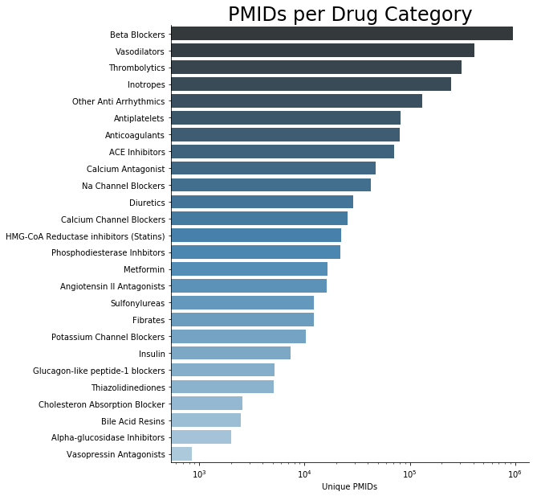
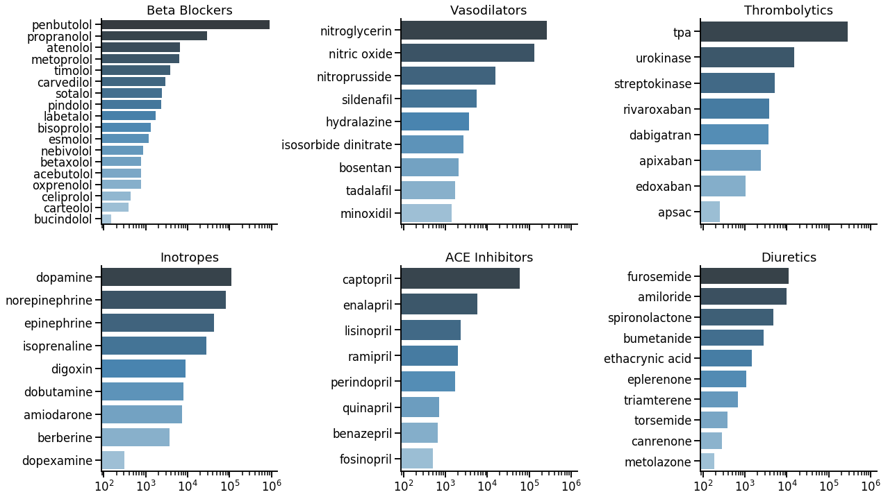
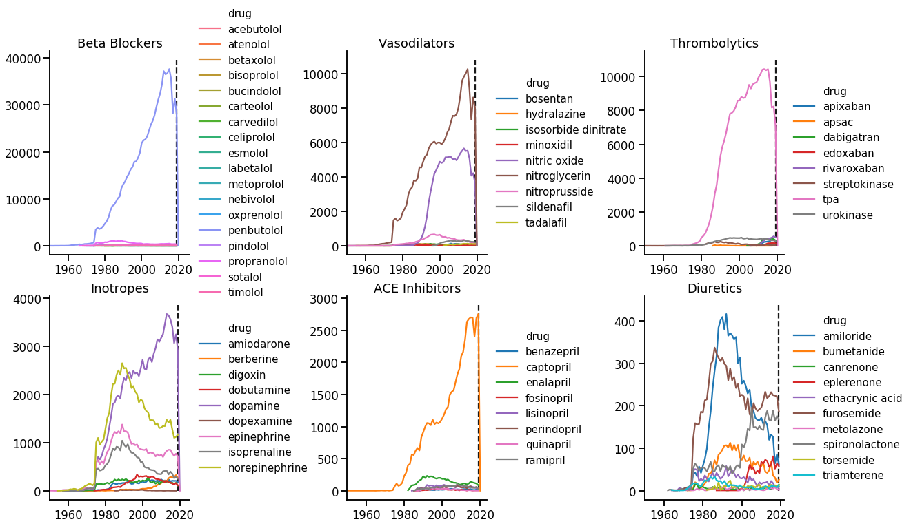
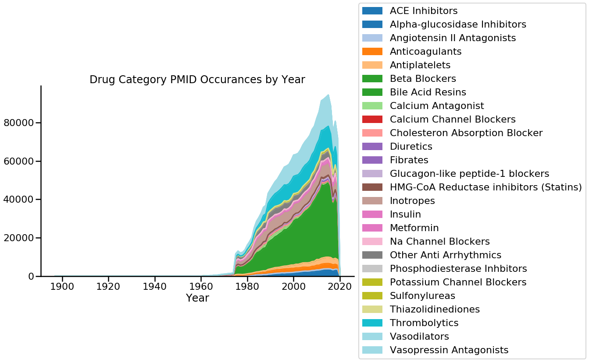
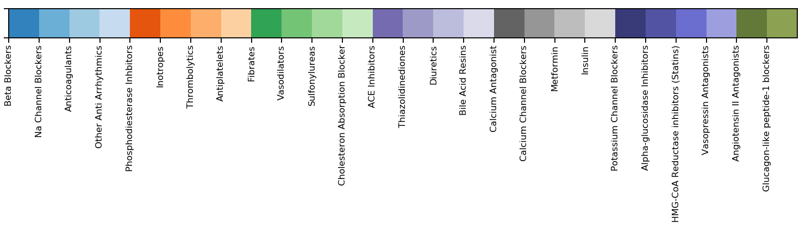
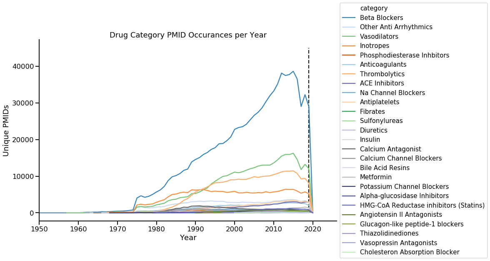
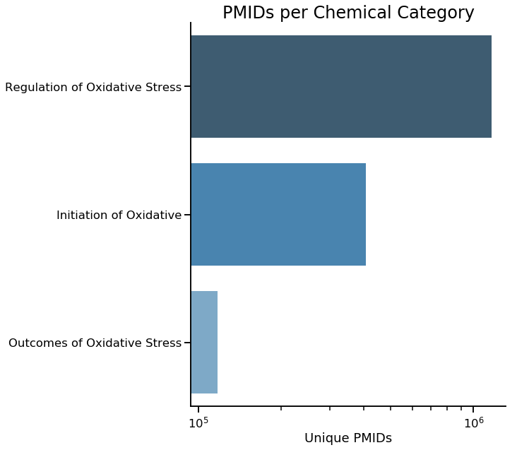
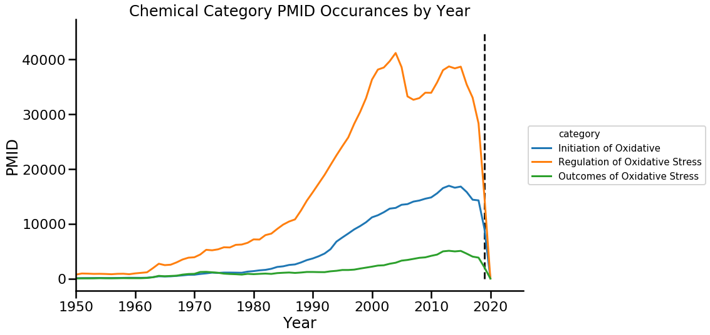
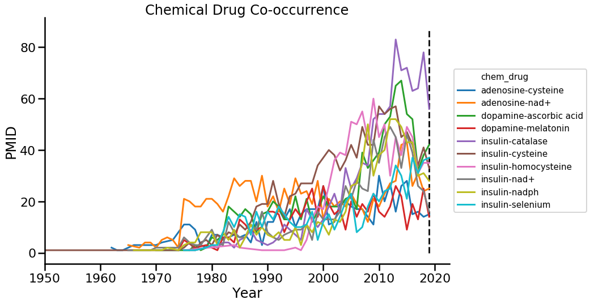
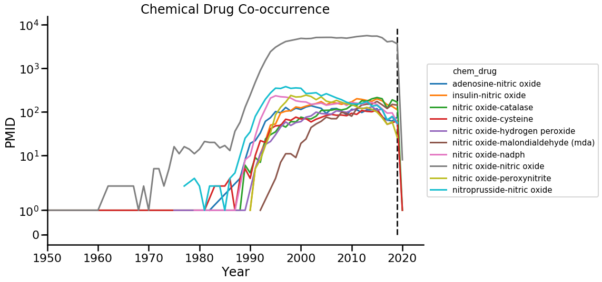

# Creates Plots to visualize Occurrences of Oxidative Stress Markers and Drugs in PubMED

Figures here are based on data from the `chemical_drug_elastic_occurance.ipynb` notebook which scans the elastic search indexed pubmed abstracts for markers and drugs. 


```python
import seaborn as sns
import matplotlib.pyplot as plt
import pandas as pd
```

## Plotting Drug Occurrences over time


```python
drugs = pd.read_csv('output/Drug_PMID_occurances.csv')
```

### By Category - Cumulative


```python
pmid_drug_cat = pd.DataFrame(drugs.groupby('category').PMID.nunique()).reset_index()
```


```python
_, ax =plt.subplots(figsize=(8,10))
ax.set_xscale('log')
sns.set_context('poster', font_scale=1)
sns.barplot(
    x='PMID',
    y='category',
    data=pmid_drug_cat.sort_values(by='PMID', ascending=False),
    palette='Blues_d'
)
ax.set_xlabel('Unique PMIDs')
ax.set_ylabel('')
ax.set_title('PMIDs per Drug Category');
sns.despine()
```





### Each drug plotted by Category - Cumulative


```python
cats_of_interest = [
    'Beta Blockers',
    'Vasodilators',
    'Thrombolytics',
    'Inotropes',
    'ACE Inhibitors',
    'Diuretics'
]
cols=3
rows=2
sns.set_context('talk', font_scale=1)
fig, axes = plt.subplots(nrows=rows, ncols=cols, figsize=(20,12), sharex=True)
fig.subplots_adjust(wspace=.7)
drugs[drugs.category == 'Diuretics'].groupby('drug').PMID.nunique()
for i in range(len(cats_of_interest)):
    ax = axes.flatten()[i]
    ax.set_xscale('log')
    cat_pmid = pd.DataFrame(drugs[drugs.category == cats_of_interest[i]].groupby('drug').PMID.nunique()).reset_index()
    sns.barplot(
        x='PMID',
        y='drug',
        data=cat_pmid.sort_values(by='PMID', ascending=False),
        palette='Blues_d',
        ax=ax,
    )
    ax.set_xlabel('')
    ax.set_ylabel('')
    ax.set_title(cats_of_interest[i])
    sns.despine()

```





### Each drug plotted by Category - Over time


```python
cats_of_interest = [
    'Beta Blockers',
    'Vasodilators',
    'Thrombolytics',
    'Inotropes',
    'ACE Inhibitors',
    'Diuretics'
]
cols=3
rows=2
sns.set_context('talk', font_scale=1)
fig, axes = plt.subplots(nrows=rows, ncols=cols, figsize=(20,12))
fig.subplots_adjust(wspace=.7)
drugs[drugs.category == 'Diuretics'].groupby('drug').PMID.nunique()
for i in range(len(cats_of_interest)):
    ax = axes.flatten()[i]
    cat_pmid = pd.DataFrame(drugs[drugs.category == cats_of_interest[i]].groupby(['drug', 'Year']).PMID.nunique()).reset_index()
    sns.lineplot(
        x='Year',
        y='PMID',
        hue='drug',
        data=cat_pmid,
        ax=ax,
    )
    # Shrink current axis by 20%
    box = ax.get_position()
    ax.set_position([box.x0, box.y0, box.width * 0.8, box.height])
    xlims = ax.get_xlim()
    ax.set_xlim([1950,xlims[1]])
    ax.vlines([2019], ymax=ax.get_ylim()[1], ymin=0, linestyle='dashed', alpha=0.9)
    # Put a legend to the right of the current axis
    ax.legend(loc='center left', frameon=False, fontsize=15, bbox_to_anchor=(1, 0.5))
    ax.set_xlabel('')
    ax.set_ylabel('')
    ax.set_title(cats_of_interest[i])
    sns.despine()

```





### Plotting occurances over time for each category. Done as a stackplot and a lineplot


```python
pubs_per_year = pd.DataFrame(drugs.groupby(['Year', 'category']).PMID.nunique()).reset_index()
```


```python
ppy_piv = pubs_per_year.pivot_table(
    columns='category',
    index='Year',
    values='PMID',
    fill_value=0
)
```


```python

ax = ppy_piv.plot.area(figsize=(16,8), colormap='tab20')
# Shrink current axis by 20%
box = ax.get_position()
ax.set_position([box.x0, box.y0, box.width * 0.8, box.height])

# Put a legend to the right of the current axis
ax.legend(loc='center left', bbox_to_anchor=(1, 0.5))
ax.set_title('Drug Category PMID Occurances by Year')
sns.despine()
```





```python
drug_pal = sns.color_palette("tab20c", n_colors=drugs.category.nunique())
drug_pal[-6:] = sns.color_palette("tab20b", n_colors=12)[:6]
drug_order = pubs_per_year.sort_values(by='PMID').category.unique()

drug_pal_dict = dict(zip(drug_order, drug_pal))

sns.palplot(drug_pal)
plt.gca().set_xticklabels(drug_order)
plt.xticks(rotation=90);
```





```python
fig, ax = plt.subplots(figsize=(16,8))
#ax.set_yscale('log')

sns.lineplot(
    x='Year',
    y='PMID',
    hue='category',
    data=pubs_per_year,
    palette=drug_pal_dict,
    ax=ax
)
# Shrink current axis by 20%
box = ax.get_position()
ax.set_position([box.x0, box.y0, box.width * 0.8, box.height])

# Put a legend to the right of the current axis
ax.legend(loc='center left', bbox_to_anchor=(1, 0.5), fontsize=15)
ax.set_title('Drug Category PMID Occurances per Year')
xlims = ax.get_xlim()
ax.set_xlim([1950,xlims[1]])
ax.vlines([2019], ymax=45000, ymin=0, linestyle='dashed', alpha=0.9)
ax.set_ylabel('Unique PMIDs')
sns.despine()
```





## Markers of Oxidative Stress Occurrence Plotting


```python
chems = pd.read_csv('output/Chemical_PMID_occurances.csv')
```


```python
pmid_chem_cat = pd.DataFrame(chems.groupby('category').PMID.nunique()).reset_index()
```


```python
_, ax =plt.subplots(figsize=(8,10))
ax.set_xscale('log')
sns.set_context('poster', font_scale=1)
sns.barplot(
    x='PMID',
    y='category',
    data=pmid_chem_cat.sort_values(by='PMID', ascending=False),
    palette='Blues_d'
)
ax.set_xlabel('Unique PMIDs')
ax.set_ylabel('')
ax.set_title('PMIDs per Chemical Category');
sns.despine();
```





```python
fig, ax = plt.subplots(figsize=(16,8))

pubs_per_year = pd.DataFrame(chems.groupby(['Year', 'category']).PMID.nunique()).reset_index()
sns.lineplot(
    x='Year',
    y='PMID',
    hue='category',
    data=pubs_per_year,
    ax=ax
)
# Shrink current axis by 20%
box = ax.get_position()
ax.set_position([box.x0, box.y0, box.width * 0.8, box.height])

# Put a legend to the right of the current axis
ax.legend(loc='center left', bbox_to_anchor=(1, 0.5), fontsize=15)
ax.set_title('Chemical Category PMID Occurances by Year')
xlims = ax.get_xlim()
ax.set_xlim([1950,xlims[1]])
ax.vlines([2019], ymax=45000, ymin=0, linestyle='dashed', alpha=0.9)
sns.despine()
```





## Chem Drug Co-Occurance Plots


```python
pair_occur = pd.read_csv('output/chem_drug_pair_matches.csv')
```


```python
top_pair = pd.DataFrame(pair_occur.groupby(['drug', 'chemical']).PMID.nunique()).reset_index()
top_pair = top_pair.sort_values(by='PMID', ascending=False)
top_pair.head(n=20)
```


<div>
<style scoped>
    .dataframe tbody tr th:only-of-type {
        vertical-align: middle;
    }

    .dataframe tbody tr th {
        vertical-align: top;
    }

    .dataframe thead th {
        text-align: right;
    }
</style>
<table border="1" class="dataframe">
  <thead>
    <tr style="text-align: right;">
      <th></th>
      <th>drug</th>
      <th>chemical</th>
      <th>PMID</th>
    </tr>
  </thead>
  <tbody>
    <tr>
      <th>1687</th>
      <td>nitric oxide</td>
      <td>nitric oxide</td>
      <td>129616</td>
    </tr>
    <tr>
      <th>1766</th>
      <td>nitroprusside</td>
      <td>nitric oxide</td>
      <td>6429</td>
    </tr>
    <tr>
      <th>1686</th>
      <td>nitric oxide</td>
      <td>nadph</td>
      <td>4496</td>
    </tr>
    <tr>
      <th>1692</th>
      <td>nitric oxide</td>
      <td>peroxynitrite</td>
      <td>3955</td>
    </tr>
    <tr>
      <th>1226</th>
      <td>insulin</td>
      <td>nitric oxide</td>
      <td>3926</td>
    </tr>
    <tr>
      <th>1653</th>
      <td>nitric oxide</td>
      <td>catalase</td>
      <td>3161</td>
    </tr>
    <tr>
      <th>67</th>
      <td>adenosine</td>
      <td>nitric oxide</td>
      <td>2985</td>
    </tr>
    <tr>
      <th>1672</th>
      <td>nitric oxide</td>
      <td>hydrogen peroxide</td>
      <td>2292</td>
    </tr>
    <tr>
      <th>1678</th>
      <td>nitric oxide</td>
      <td>malondialdehyde (mda)</td>
      <td>2122</td>
    </tr>
    <tr>
      <th>1654</th>
      <td>nitric oxide</td>
      <td>cysteine</td>
      <td>2093</td>
    </tr>
    <tr>
      <th>1810</th>
      <td>norepinephrine</td>
      <td>nitric oxide</td>
      <td>1611</td>
    </tr>
    <tr>
      <th>1661</th>
      <td>nitric oxide</td>
      <td>glutathione (gsh)</td>
      <td>1535</td>
    </tr>
    <tr>
      <th>790</th>
      <td>dopamine</td>
      <td>nitric oxide</td>
      <td>1299</td>
    </tr>
    <tr>
      <th>1194</th>
      <td>insulin</td>
      <td>cysteine</td>
      <td>1248</td>
    </tr>
    <tr>
      <th>1193</th>
      <td>insulin</td>
      <td>catalase</td>
      <td>1116</td>
    </tr>
    <tr>
      <th>63</th>
      <td>adenosine</td>
      <td>nad+</td>
      <td>1099</td>
    </tr>
    <tr>
      <th>761</th>
      <td>dopamine</td>
      <td>ascorbic acid</td>
      <td>1047</td>
    </tr>
    <tr>
      <th>2119</th>
      <td>sildenafil</td>
      <td>nitric oxide</td>
      <td>1041</td>
    </tr>
    <tr>
      <th>1728</th>
      <td>nitroglycerin</td>
      <td>nitric oxide</td>
      <td>1038</td>
    </tr>
    <tr>
      <th>300</th>
      <td>atropine</td>
      <td>nitric oxide</td>
      <td>1031</td>
    </tr>
  </tbody>
</table>
</div>


```python
not_nos = top_pair[
    ~((top_pair.drug == 'nitric oxide') |
    (top_pair.chemical == 'nitric oxide'))
]
not_nos.head(n=10)
```


<div>
<style scoped>
    .dataframe tbody tr th:only-of-type {
        vertical-align: middle;
    }

    .dataframe tbody tr th {
        vertical-align: top;
    }

    .dataframe thead th {
        text-align: right;
    }
</style>
<table border="1" class="dataframe">
  <thead>
    <tr style="text-align: right;">
      <th></th>
      <th>drug</th>
      <th>chemical</th>
      <th>PMID</th>
    </tr>
  </thead>
  <tbody>
    <tr>
      <th>1194</th>
      <td>insulin</td>
      <td>cysteine</td>
      <td>1248</td>
    </tr>
    <tr>
      <th>1193</th>
      <td>insulin</td>
      <td>catalase</td>
      <td>1116</td>
    </tr>
    <tr>
      <th>63</th>
      <td>adenosine</td>
      <td>nad+</td>
      <td>1099</td>
    </tr>
    <tr>
      <th>761</th>
      <td>dopamine</td>
      <td>ascorbic acid</td>
      <td>1047</td>
    </tr>
    <tr>
      <th>1209</th>
      <td>insulin</td>
      <td>homocysteine</td>
      <td>915</td>
    </tr>
    <tr>
      <th>1225</th>
      <td>insulin</td>
      <td>nadph</td>
      <td>835</td>
    </tr>
    <tr>
      <th>1222</th>
      <td>insulin</td>
      <td>nad+</td>
      <td>802</td>
    </tr>
    <tr>
      <th>1234</th>
      <td>insulin</td>
      <td>selenium</td>
      <td>703</td>
    </tr>
    <tr>
      <th>41</th>
      <td>adenosine</td>
      <td>cysteine</td>
      <td>648</td>
    </tr>
    <tr>
      <th>784</th>
      <td>dopamine</td>
      <td>melatonin</td>
      <td>619</td>
    </tr>
  </tbody>
</table>
</div>


```python
fig, ax = plt.subplots(figsize=(16,8))
sns.set_context('poster', font_scale=1)

n=10
filt_top = pair_occur.merge(
    not_nos[['drug','chemical']].head(n=n)
)

filt_top = filt_top.assign(chem_drug=filt_top.drug.map(str) + '-' + filt_top.chemical)
filt_top_count = pd.DataFrame(
    filt_top.groupby(['chem_drug', 'Year']).PMID.nunique()
).reset_index()

sns.lineplot(
    data=filt_top_count,
    x='Year',
    y='PMID',
    hue='chem_drug',
    ax=ax
)
box = ax.get_position()
ax.set_position([box.x0, box.y0, box.width * 0.8, box.height])

# Put a legend to the right of the current axis
ax.legend(loc='center left', bbox_to_anchor=(1, 0.5), fontsize=15)
ax.set_title('Chemical Drug Co-occurrence')
xlims = ax.get_xlim()
ax.set_xlim([1950,xlims[1]])
ax.vlines([2019], ymax=ax.get_ylim()[1], ymin=0, linestyle='dashed', alpha=0.9)

sns.despine();
```





```python
fig, ax = plt.subplots(figsize=(16,8))

n=10
filt_top = pair_occur.merge(
    top_pair[['drug','chemical']].head(n=n)
)

filt_top = filt_top.assign(chem_drug=filt_top.drug.map(str) + '-' + filt_top.chemical)
filt_top_count = pd.DataFrame(
    filt_top.groupby(['chem_drug', 'Year']).PMID.nunique()
).reset_index()
ax.set_yscale('symlog')
sns.lineplot(
    data=filt_top_count,
    x='Year',
    y='PMID',
    hue='chem_drug',
    ax=ax
)
box = ax.get_position()
ax.set_position([box.x0, box.y0, box.width * 0.8, box.height])

# Put a legend to the right of the current axis
ax.legend(loc='center left', bbox_to_anchor=(1, 0.5), fontsize=15)
ax.set_title('Chemical Drug Co-occurrence')
xlims = ax.get_xlim()
ax.set_xlim([1950,xlims[1]])
ax.vlines([2019], ymax=ax.get_ylim()[1], ymin=0, linestyle='dashed', alpha=0.9)

sns.despine();
```




