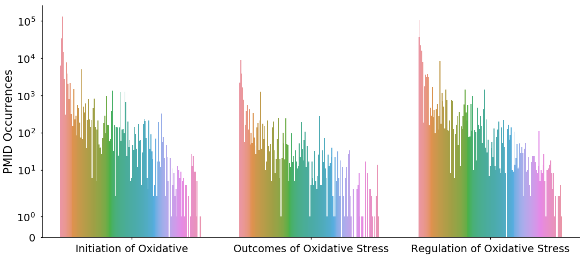

# Creating CaseOLAP Inputs by linking occurrences of Drugs and Markers of Oxidative Stress

This file creates two outputs: `output/metadata_pmid2count.json` and `output/metadata_pmid2count.json` which are used as the inputs for running the final score calculation in caseOLAP. 


```python
from elasticsearch import Elasticsearch
from elasticsearch_dsl import Search, Q
import pandas as pd
import numpy as np
import matplotlib.pyplot as plt
import seaborn as sns
import json
```

## Importing oxidative stress chemical PMID occurrences
- PMID occurrence list generated in `chemical_drug_elastic_occurance.ipynb`


```python
ox_cat_df = pd.read_csv('output/Chemical_PMID_occurances.csv')
print(ox_cat_df.shape)
ox_cat_df.head()
```

    (3291433, 5)


<div>
<style scoped>
    .dataframe tbody tr th:only-of-type {
        vertical-align: middle;
    }

    .dataframe tbody tr th {
        vertical-align: top;
    }

    .dataframe thead th {
        text-align: right;
    }
</style>
<table border="1" class="dataframe">
  <thead>
    <tr style="text-align: right;">
      <th></th>
      <th>Article MeSH</th>
      <th>PMID</th>
      <th>category</th>
      <th>chemical</th>
      <th>MeSH</th>
    </tr>
  </thead>
  <tbody>
    <tr>
      <th>0</th>
      <td>['Alcohols', 'metabolism', 'toxicity', 'Aldehy...</td>
      <td>24852702</td>
      <td>Initiation of Oxidative</td>
      <td>4-hydroxy-2-nonenal (4-HNE)</td>
      <td>Aldehydes</td>
    </tr>
    <tr>
      <th>1</th>
      <td>['Adult', 'Aldehydes', 'metabolism', 'Case-Con...</td>
      <td>24854020</td>
      <td>Initiation of Oxidative</td>
      <td>4-hydroxy-2-nonenal (4-HNE)</td>
      <td>Aldehydes</td>
    </tr>
    <tr>
      <th>2</th>
      <td>['Acetylcysteine', 'pharmacology', 'Aldehydes'...</td>
      <td>24854122</td>
      <td>Initiation of Oxidative</td>
      <td>4-hydroxy-2-nonenal (4-HNE)</td>
      <td>Aldehydes</td>
    </tr>
    <tr>
      <th>3</th>
      <td>['4-Butyrolactone', 'chemistry', 'Aldehydes', ...</td>
      <td>24877583</td>
      <td>Initiation of Oxidative</td>
      <td>4-hydroxy-2-nonenal (4-HNE)</td>
      <td>Aldehydes</td>
    </tr>
    <tr>
      <th>4</th>
      <td>['Absorption, Physicochemical', 'Acetonitriles...</td>
      <td>24878441</td>
      <td>Initiation of Oxidative</td>
      <td>4-hydroxy-2-nonenal (4-HNE)</td>
      <td>Aldehydes</td>
    </tr>
  </tbody>
</table>
</div>


```python
pmid_per_cat_count = pd.DataFrame(ox_cat_df.groupby('category').PMID.nunique())
pmid_per_cat_count
```


<div>
<style scoped>
    .dataframe tbody tr th:only-of-type {
        vertical-align: middle;
    }

    .dataframe tbody tr th {
        vertical-align: top;
    }

    .dataframe thead th {
        text-align: right;
    }
</style>
<table border="1" class="dataframe">
  <thead>
    <tr style="text-align: right;">
      <th></th>
      <th>PMID</th>
    </tr>
    <tr>
      <th>category</th>
      <th></th>
    </tr>
  </thead>
  <tbody>
    <tr>
      <th>Initiation of Oxidative</th>
      <td>405009</td>
    </tr>
    <tr>
      <th>Outcomes of Oxidative Stress</th>
      <td>117386</td>
    </tr>
    <tr>
      <th>Regulation of Oxidative Stress</th>
      <td>1163548</td>
    </tr>
  </tbody>
</table>
</div>


## Finding drug occurrences for each oxidative stress category
- Loads `output/Drug_PMID_occurances.csv` file generated in `chemical_drug_elastic_occurance.ipynb`
- merges with PMID occurances of oxidative stress categories defined above in variable `ox_cat_df`


```python
drug_occurance_df = pd.read_csv('output/Drug_PMID_occurances.csv')
drug_occurance_df['PMID'] = drug_occurance_df['PMID'].astype(int)
drug_occurance_df.head()
```


<div>
<style scoped>
    .dataframe tbody tr th:only-of-type {
        vertical-align: middle;
    }

    .dataframe tbody tr th {
        vertical-align: top;
    }

    .dataframe thead th {
        text-align: right;
    }
</style>
<table border="1" class="dataframe">
  <thead>
    <tr style="text-align: right;">
      <th></th>
      <th>MeSH</th>
      <th>PMID</th>
      <th>abstract</th>
      <th>count</th>
      <th>title</th>
      <th>drug</th>
    </tr>
  </thead>
  <tbody>
    <tr>
      <th>0</th>
      <td>['Acarbose', 'therapeutic use', 'Asian Contine...</td>
      <td>24853116</td>
      <td>to demonstrate if weight loss achieved with ac...</td>
      <td>14</td>
      <td>Acarbose monotherapy and weight loss in Easter...</td>
      <td>acarbose</td>
    </tr>
    <tr>
      <th>1</th>
      <td>['Asteraceae', 'chemistry', 'Astragalus Plant'...</td>
      <td>24863354</td>
      <td>the incidence of diabetes has increased consid...</td>
      <td>2</td>
      <td>Comparative evaluation of polysaccharides isol...</td>
      <td>acarbose</td>
    </tr>
    <tr>
      <th>2</th>
      <td>['Acarbose', 'therapeutic use', 'Aged', 'Asian...</td>
      <td>24866329</td>
      <td>postprandial hyperglycemia and blood glucose f...</td>
      <td>10</td>
      <td>Effects of sitagliptin or mitiglinide as an ad...</td>
      <td>acarbose</td>
    </tr>
    <tr>
      <th>3</th>
      <td>['Blood Glucose', 'physiology', 'Cyclohexanes'...</td>
      <td>12918894</td>
      <td>nateglinide is a new oral antidiabetic agent t...</td>
      <td>2</td>
      <td>Nateglinide (Starlix): update on a new antidia...</td>
      <td>acarbose</td>
    </tr>
    <tr>
      <th>4</th>
      <td>['Digoxin', 'adverse effects', 'blood', 'Drug ...</td>
      <td>20568489</td>
      <td>digoxin has a narrow therapeutic margin and po...</td>
      <td>2</td>
      <td>Digoxin: serious drug interactions.</td>
      <td>acarbose</td>
    </tr>
  </tbody>
</table>
</div>


```python
drug_ox_cat_df = ox_cat_df[['category', 'PMID']].drop_duplicates().merge(
    drug_occurance_df,
    validate='m:m',
    how='inner',
)
```


```python
# Drugs listed per category
pd.DataFrame(drug_ox_cat_df.groupby('category').drug.nunique())
```


<div>
<style scoped>
    .dataframe tbody tr th:only-of-type {
        vertical-align: middle;
    }

    .dataframe tbody tr th {
        vertical-align: top;
    }

    .dataframe thead th {
        text-align: right;
    }
</style>
<table border="1" class="dataframe">
  <thead>
    <tr style="text-align: right;">
      <th></th>
      <th>drug</th>
    </tr>
    <tr>
      <th>category</th>
      <th></th>
    </tr>
  </thead>
  <tbody>
    <tr>
      <th>Initiation of Oxidative</th>
      <td>142</td>
    </tr>
    <tr>
      <th>Outcomes of Oxidative Stress</th>
      <td>133</td>
    </tr>
    <tr>
      <th>Regulation of Oxidative Stress</th>
      <td>146</td>
    </tr>
  </tbody>
</table>
</div>


```python
# PMID Count per drug in a category

sns.set_context('talk', font_scale=1.5)
fig, ax = plt.subplots(figsize=(18,8))

ax.set_yscale('symlog')

sns.countplot(
    x='category',
    hue='drug',
    data=drug_ox_cat_df,
    ax=ax,
)
ax.legend().remove()
sns.despine()
ax.set_xlabel('')
ax.set_ylabel('PMID Occurrences')
```


    Text(0, 0.5, 'PMID Occurrences')





```python
# Print top drugs per category
pmid_per_drug_count = pd.DataFrame(drug_ox_cat_df.groupby(['drug','category']).PMID.nunique())

for cat, c_df in pmid_per_drug_count.reset_index().groupby('category'):
    print(
        cat,':',
        ', '.join(c_df.sort_values(by='PMID', ascending=False).head(n=10).drug.values),
        '\n'
    )
```

    Initiation of Oxidative : nitric oxide, penbutolol, nitroglycerin, nitroprusside, tpa, adenosine, norepinephrine, dopamine, aspirin, captopril 
    
    Outcomes of Oxidative Stress : penbutolol, nitric oxide, tpa, nitroglycerin, adenosine, dopamine, captopril, aspirin, norepinephrine, isoprenaline 
    
    Regulation of Oxidative Stress : penbutolol, tpa, nitric oxide, nitroglycerin, adenosine, dopamine, heparin, norepinephrine, captopril, aspirin 
    


## Creating inputs to caseOLAP pipeline

### metadata_pmid2count.json
- File containing a dictionary with structure:
```
{
    "PMID": {
        "Entity": "# of Occurences"
    }
}
```


```python
pmid2count = {}
# ONLY LOOKS AT PMIDS WITH BOTH A DRUG AND A CATEGORY ASSOCIATED
for (pmid, entity), p_df in drug_occurance_df.groupby(['PMID', 'drug']):
    pmid = str(pmid)
    
    if len(p_df['count'].values) > 1:
        if len(p_df[['PMID', 'count']].drop_duplicates()) > 1:
            print('ERROR LONG VALUE', p_df)
    if not pmid in pmid2count.keys():
        pmid2count[pmid] = {}
    pmid2count[pmid][entity] = str(list(p_df['count'].values)[0])
```


```python
with open('output/metadata_pmid2count.json', 'w') as pmid2count_json:
    json.dump(pmid2count, pmid2count_json)    
```

### metadata_cell2pmid.json
- File containing a dictionary with structure:
```
{
    "Category": ["PMID",...]
}
```


```python
long_short_category_map = {
    "Initiation of Oxidative": "IoOS",
    "Outcomes of Oxidative Stress": "OoOS",
    "Regulation of Oxidative Stress": "RoOS"
}
```


```python
drug_ox_cat_df['category_short'] = drug_ox_cat_df['category'].map(long_short_category_map)
```


```python
cell2pmid = {}
for category, c_df in drug_ox_cat_df.groupby('category_short'):
    cell2pmid[category] = list(c_df.PMID.astype(str).unique().values)
```


```python
with open('output/metadata_cell2pmid.json', 'w') as cell2pmid_json:
    json.dump(cell2pmid, cell2pmid_json)    
```
