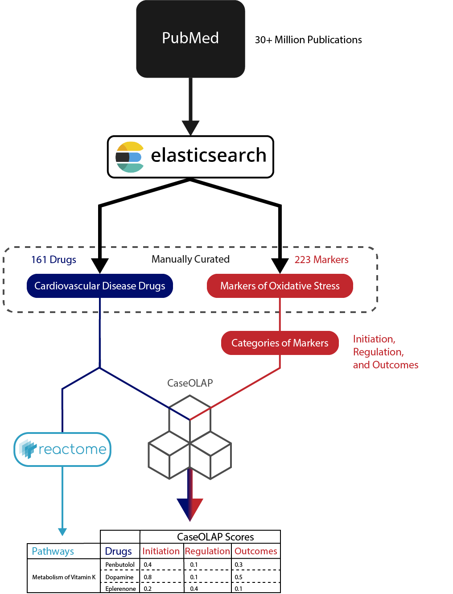

# Ping Lab Rotation Project
__Developing Knowledge Graphs relating Cardiovascular Disease and Oxidative Stress__  
This work was presented at the December 6th BioText Mining Meeting. Slides from that presentation can be found [here](https://docs.google.com/presentation/d/1CTD2HrC2xMbVBLcdXfollsNP2hz-VCiCZNz4MbV3-a4/edit?usp=sharing)

## Tools

__caseOLAP__: A novel text-mining platform to find strenght of relation between entities in two categories through searching of PubMed ID abstracts.  
__Neo4j__: A popular graph database implementation used to represent the knowledge graph  
__ElasticSearch__: A powerful search engine allowing full text searches

## Methods

We began this project by manually curating 161 Cardiovascular disease drugs, and 223 Markers of Oxidative Stress (These markers are often referred to as Chemicals inside this documentation). 

With those lists in mind, we downloading the full dataset of available pubmed abstracts, and indexed them and associated metadata using elasticsearch. This allows us to then search for terms within pubmed and where they occur. We specifically looked
for occurrences of the drugs and markers within PubMed. 

The markers of oxidative stress are binned in to 3 categories: Initiation, Regulation, and Outcomes of oxidative stress. 
To quantify the relationship between drugs and markers, caseOLAP was run using their occurrences within PubMed. The result is a table where each drug has a caseOLAP for each of the 3 categories of oxidative stress markers. 

The final step was to map Drugs to pathways/mechanisms of action. We used the graphical database of Reactome to do this linkage. A drug can then be categorised by the reaction its involved in and the pathway that reaction is a piece of.

