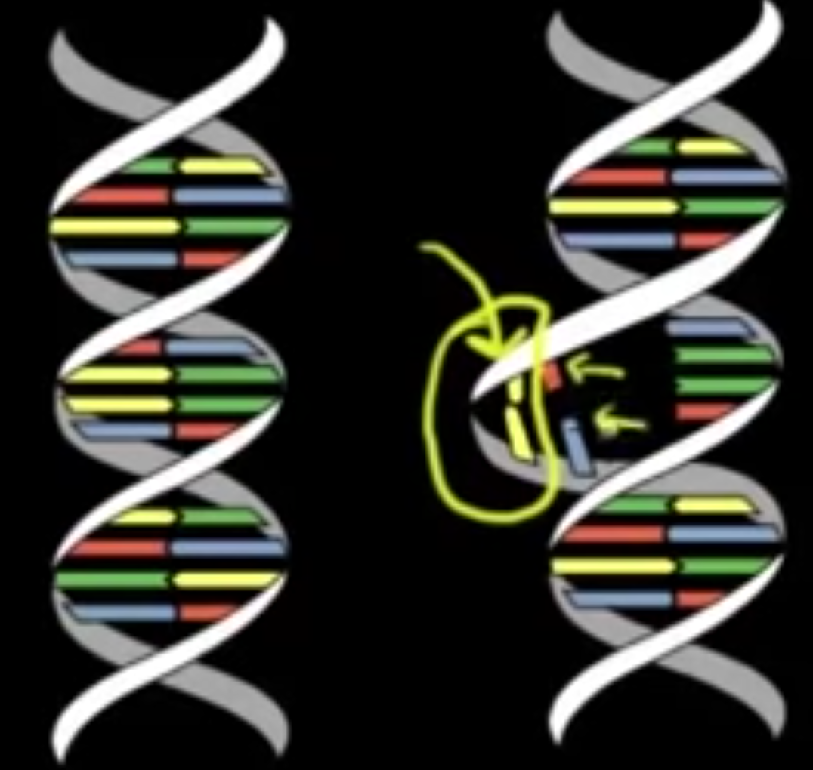
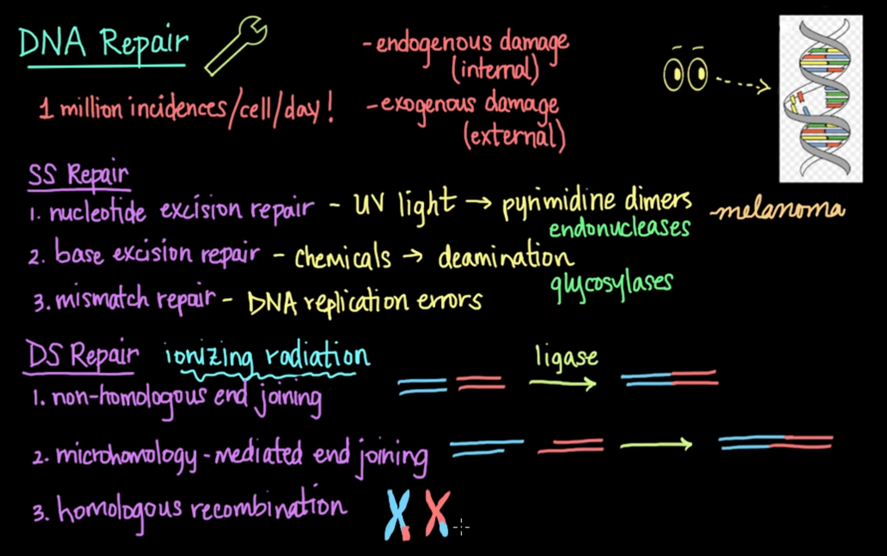

# DNA Repair Pathway

## Khan Academy Medicine Notes

### [DNA Repair 1- khanacademymedicine](https://www.youtube.com/watch?v=o4yJF90OR9M)
* Pyrimidines: Thymine/Cytosine - single ring structure (6 sided)
* Purines: Adenine/Guanine - two rings (6 + 5 sides)
* DNA polymerase III can recognize errors and repair them from end of DNA strand its synthesizing
    * Exonuclease activity: removing nucleotide at END of a DNA strand
        * For DNAP III it is 3’-5’ specifically
    * DNA Pol I has exonuclease activity in the 5’-3’ direction
        * Is used normally to turn RNA primer of DNA synthesis in to DNA 
    * Repair capabilities of DNAP I and III turn error rate from 1 in 100k, to 1 in 100 million

Mismatch repair mechanism: 
1. One end marked with a cut
2. Exonuclease removes one side of mismatch
3. DNA polymerase adds correct basepair in
4. DNA ligases fix cut
* Methylation used to distinguish which strand is correct in prokaryotes
* Mechanism unknown in eukaryotes

### [DNA Repair 2- khanacademymedicine](https://www.youtube.com/watch?v=PySVsEUnrng)
* UV light can damage DNA via creation of pyrimidine dimers
    * Thymine-Thymine or Cytosine-Cytosine:
    

* DNA Damage ≠ DNA Mutation
    * Damage (like in UV light) Structure is altered, but sequence is the same

Nucleotide Excision Repair: Fixes DNA damage
* Endonuclease: Cuts out structurally aberrant nucleotides
* DNA polymerase re-adds correct nucleotides
* DNA Ligase fixes backbone and connects new nucleotides to appropriate base

Summary:

## Reactome Pathway Visualizer
### DNA Repair Node: R-HSA-73894.3
* Specific mechanisms of repair depend on cell type, cell cycle, and cellular environment
    * Utilization of low fidelity “last resort” mechanisms associated with senescence, aging, and cancer
* Germline mutations in dna repair genes are underlying causes of many familial cancer syndromes
* When level of DNA damage exceeds DNA repair mechanism capacity, cell undergoes apoptosis 
    * Actively dividing cells have limited time available for DNA repair, making them sensitive to DNA damaging agents
* Several primary pathways of human DNA repair. They are intimately associated with DNA replication, recombination, cell cycle, and apoptosis
    * DNA damage bypass
        * Does not remove damage, but allows trans-lesion DNA synthesis (TLS) using a damaged template strand. TLS allows cells to complete DNA replication postponing repair until cell division finishes.
        * DNA polymerases utilized are error-prone, frequently introducing base substitutions and/or small insertions and deletions
    * DNA damage reversal
        * Acts on a very narrow spectrum of damaging base modifications to remove modifying groups and restore bases to original state
    * Base excision repair (BER)
        * Involves several DNA glycosylases that cleave a vast array of damaged bases from the DNA sugar-phosphate backbone
        * Glycosylases create an abasic site that is then processed by endonuclease, polymerases, and ligases.
            * Choice of processing depends on cell cycle stage, glycosylase identity, and presence of additional damage
        * Yields error free DNA molecules
    * Nucleotide excision repair (NER)
        * Removes bulky lesions that cause distortion of the DNA double helix
        * Excise oligonucleotide that contains the lesion from affected DNA strand
            * Followed by gap filling DNA synthesis and ligation of repaired molecule
    * Mismatch repair (MMR)
        * MMR proteins recognize mismatched BPs or small indel loops during DNA replication and correct erroneous pairing by excising mismatched nucleotides exclusively from nascent DNA strand leaving template in tact
    * Repair of double strand breaks (DSBs)
        * Can be repaired very accurately with homologous recombination repair (HRR) 
        * Other error prone pathways to repair include: 
            * non homologous end joining (NHEJ)
            * Single Strand annealing (SSA)
            * Microhomology-mediated end joining (MMEJ)
        * DSBs generated through DNA damaging agents like X-rays or Reactive oxygen species (ROS) 
            * Are also intermediates of the Fanconi Anemia pathway
    * Repair of interstrand crosslinks (Fanconi anemia pathway)
        * Inter-stand cross-linking (ICL) agents damage DNA by introducing covalent bonds between two DNA strands, this prevents progression of a DNA replication fork
        * Fanconi anemia proteins repair ICLs by unhooking them from on DNA strand. TLS enables replication fork to bypass unhooked ICL resulting in two replicated DNA molecules
            * One contains a DSB and triggers double strand break repair
            * One contains bulky unhooked ICL that is removed using NER
* Suggested review: Lindahl and Wood 1999 and Curtin 2012

### Fanconi Anemia (FA) Pathway: R-HSA-6783310.2
* FA is a genetic disease of genome instability characterized by congenital skeletal defects, aplastic anemia, leukemia susceptibility, cellular sensitivity to DNA damaging events
    * 15 complementation groups (FA-A, -B, -C, -D1, -D2, -E, -F, -G, -I, -J, -L, -M, -N, -O and -P)
    * Groups correspond to the genes: FANCA, FANCB, FANCC, FANCD1/BRCA2, FANCD2, FANCE, FANCF, FANCG, FANCJ/BRIP1, FANCL, FANCM, FANCN/PALB2, FANCO/RAD51C and FANCP/SLX4
        * Eight of these proteins, FANCA, FANCB, FANCC, FANCE, FANCF, FANCG, FANCL, and FANCM, together with FAAP24, FAAP100, FAAP20, APITD1 and STRA13 Create nuclear complex termed FA Core Complex
            * E3 ubiquitin ligase that recognizes and is activated by ICLs
            * Triggers mono-ubiquitination of FANCD2 and FANCI which initiates repair of ICL-DNA
                * FANCD2 and FANCI form a complex and are mutually dependent on one another for their respective monoubiquitination
            * After DNA damage and during S phase, FANCD2 localizes to discrete nuclear foci that colocalize with proteins involved in homologous recombination repair like BRCA1 and RAD51
    * FA Regulated by ubiquitination/phosphorilation of FANCD2 and FANCI
        * ATR-dependent phosphorylation of FANCI and FANCD2 promotes monoubiquitination of FANCD2 stimulating FA pathway
    * Monoubiquitinated FANCD2 recruits DNA nucleases including SLX4(FANCP) and FAN1 which unhook the ICL from one of the covalently linked DNA strands
    * DNA polymerase nu (POLN) performs translation DNA synthesis using the DNA strand with the unhooked ICL as a template to bypass the unhooked ICL
        * NER then removes the unhooked ICL
    * Incision of stalled replication fork during the unhooking step generates a DSB repaired via HRR involving BRCA2 (FANCD1), PALB2 (FANCN), and BRIP1(FANCJ)
        * Homozygous mutations in BRCA2, PALB2, or BRIP1 result in FA
        * Heterozygous mutations predispose carriers to breast and ovarian cancer
        * These proteins role in DNA repair is BRCA1 dependent
        * Heterozygous BRCA1 mutations predispose to breast and ovarian cancer with high penetance
            * Loss of BRCA1 is embryonic lethal
            * Partial gremlin loss of BRCA1 function results in FA-like syndrome —> BRCA1 designated FANCS gene
* monoubiquitination: addition of a single ubiquitin peptide to the lysine of a protein

### Mismatch Repair (MMR): R-HSA-5358508.1
* Corrects single base mismatches and small insertion and deletion loops (IDLs) of unpaired bases. 
    * Highly conserved across prokaryotes and eukaryotes
    * Primarily associated with DNA replication
* Basic Steps:
    1. A sensor (MutS homologue) detects mismatch or IDL 
    2. Activates a set of proteins (MutL homologue and an exonuclease) to select, nick,  and exonucleolytically remove region of nucleotides from the nascent strand
    3. DNA polymerase resynthesizes the strand
    4. Ligase seals the remaining nick
* Humans have two MutS complexes
    1. MSH2:MSH6 heterodimer (MutSalpha) : Recognizes single base mismatches and loops of one or two unpaired bases
    2. MSH2:MSH3 heterodimer (MutSbeta) : Recognizes loops of two or more unpaired bases
* Upon binding mismatch, MutS complex activates in an ATP-dependent manner allowing for interactions and movement on DNA substrate
    * Interacts with MLH1:PMS2 and Exonuclease 1 (EXO1) to initiate excision of the recently replicated strand and direct DNA polymerase delta to initiate replacement of bases.
        * MLH1:PMS2 makes an incision in the strand to be repaired
        * EXO1 extends the incision to make a single stranded gap of up to 1kb that removes the mismatched bases
            * In some assays it has been found the EXO1 is not necessary, not sure why. Most of the time it is necessary
        * Replication Protein A (RPA) binds the single stranded region to prevent rewinding of DNA and allows DNA polymerase delta to synthesize new strand
        * Nick sealed by DNA Ligase I (LIG1)
    * Order of steps and structural details not fully known
* Concentrations of MMR proteins MSH2:MSH6 and MLH1:PMS2 increase in human cells during the S phase where they are at highest level and activity
    * I.E. MutSalpha has highest activity or potential for activity during DNA replication (between G1 and G2)
* Defects in MSH2, MSH6, MLH1, and PMS2 cause hereditary nonpolyposis colorectal cancer (HNPCC, also known as Lynch syndrome)

Mismatch repair (MMR) directed by MSH2:MSH6 (MutSalpha): R-HSA-5358565.1
* Single base mismatches and unpaired loops of 1-2 nucleotides
* Is about 6-fold more abundant than MSH2:MSH3 (MutSbeta) in humans
    * Imbalance of this ratio can cause mutator phenotype
* MSH6 subunit binds the mismatch which triggers the MSH2:MSH6 complex to exchange ADP to ATP
    * Conformation changes to allow movement on DNA and interact with downstream effectors
        * PCNA: Initiates excision of the recently replicated strand
        * MLH1:PMS2: endonucleolytic activity to make nick
        * EXO1: enlarges gap to hundreds of nucleotides
* DNA polymerase delta polymerizes across gap, and remaining nick is sealed by DNA ligase I LIG1

Mismatch repair (MMR) directed by MSH2:MSH3 (MutSbeta): R-HSA-5358606.1
* Binds unpaired loops of 2 or more nucleotides
* 6x lower in concentration than alpha
* Similar information as for MutSalpha
    * Key differences: MSH3 NOT specified to be the subunit that binds 

### Nucleotide Excision Repair (NER): R-HSA-5696398.2
Tree:
* Nucleotide Excision Repair (NER)
    * Global Genome Nucleotide Excision Repair (GG-NER)
        * DNA Damage Recognition in GG-NER
        * Dual incision in GG-NER
        * Formation of Incision Complex in GG-NER
        * Gap-filling DNA repair synthesis and ligation in GG-NER
    * Transcription-Coupled Nucleotide Excision Repair (TC-NER)
        * Dual incision in TC-NER
        * Formation of TC-NER Pre-Incision Complex
        * Gap-filling DNA repair synthesis and ligation in TC-NER
        
NER Overview
* First described in E.coli ~1960 as the process whereby bulky base damage is enzymatically removed from DNA facilitating the recovery of DNA synthesis and cell survival 
* Deficient NER processes linked to increased mutation rate and cancer
* Unique in prokaryotes but highly conserved in yeast and higher eukaryotes
* NER involved in repair of bulky adducts in DNA
    * UV-induced photo lesions
        * 6-4 photoproducts (6-4 PDDS)
        * Cyclobutane pyrimidine dimers (CPDs)
    * Chemical adducts formed from exposure to aflatoxin, benzopyrene and other genotoxic agents
* Two primary pathways: differ in method that DNA damage is initially recognized. Mostly same downstream
    1. Global Genome Nucleotide Excision Repair (GG-NER): transcription-independent and removes lesions from coding and non-coding DNA strands that are not being actively transcribed
    2. Transcription-coupled nucleotide excision repair (TC-NER): repairs damage in transcribed strands of active genes
* Several proteins involved in NER are key to basal transcription complex TFIIH. 
    * An ubiquitin ligase complex composed of DDB1, CUL4A or CUL4B and RBX1 participates in both GG and TC NER
        * Suggests important role of ubiquitination in NER regulation
* Mouse models used to establish relation of NER defects and cancer
* Suggested review: Lindahl and Wood 1998, Friedberg et al. 2002, Christmann et al. 2003, Hanawalt and Spivak 2008, Marteijn et al. 2014

Global Genome Nucleotide Excision Repair (GG-NER): R-HSA-5696399.1
Steps:
* DNA recognition seen as joint action of two protein complexes
    * First complex (XPC Complex): XPC, RAD23A or RAD23B, CETN2
    * UV-DDB complex: ubiquitin ligase composed of DDB1, CUL4A or CUL4B, RBX1, and GG-NER specific protein DDB2
        * In-vitro only necessary for GG-NER mediated repair of UV-induced pyrimidine dimers
        * In vivo, where DNA repair occurs in chromatin context, likely facilitates GG-NER mediated repair irrespective of DNA damage type
* After damage recognition, TFIIH complex with XPA verifies damage, unwinds helix around damage thereby creating an open bubble
* Two endonuclease ERCC5 (XPG) and comely of ERCC1 and ERCC4 (XPF) excise oligonucleotide that contains damaged base(s)
* DNA poly delta, epsilon, and/or kappa perform DNA repair synthesis
* DNA ligated

DNA Damage Recognition in GG-NER: R-HSA-5696394.1
* First complex of XPC, RAD23A/RAD23B and CETN2: Probes DNA helix and recognizes disruption in normal Watson-Crick base pairing
    * Results in binding of the XPC:RAD23:CETN2 complex to undamaged DNA strand
* Second Complex UV-DDB is necessary for recognition of UV-induced DNA damage and may contribute to retention of first complex
    * Binds the damaged DNA strand

Dual Incision in GG-NER: R-HSA-5696400.1
* Dual incision at the damaged DNA strand excises the oligonucleotide that contains the lesion from the open bible.
    * Excised region is ~27-30 bases long
* 5’ incision by ERCC1:ERCC4 endonuclease
*  3’ incision by ERCC5 endonuclease

Formation of Incision Complex in GG-NER: R-HSA-5696395.1
* After XPC complex and UV-DDB complex bind damaged DNA, a basal transcription factor TFIIH is recruited to the NER site
* DNA helicases ERCC2 (XPD) and ERCC3 (XPB) are subunits of TFIIH complex
    * ERCC2 unwinds the DNA around the damage in concert with ATPase activity of ERCC3
    * Creates open bubble
* Simultaneously presence of the damage is verified by XPA
    * Recruitment of XPA is partially regulated by PARP1 and PARP2
* During excision by ERCC1:ERCC4 and ERCC5, RPA heterotrimer coats the undamaged na strand to protect it from endonucleolytic attack

Gap-filling DNA repair synthesis and ligation in GG-NER: R-HSA-5696397.1
* GG-NER completed by DNA repair synthesis that fills the single stranded gap created after excision
    * Performed by DNA polymerase epsilon or delta or the “Y family DNA polymerase kappa” (POLK) 
* LIG1 or LIg3 (as part of LIG3:XRCC1 complex) ligate newly synthesized stretch of oligonucleotides

Transcription-Coupled Nucleotide Excision Repair (TC-NER): R-HSA-6781827.1
* Damage in transcribed strands of active genes repaired through Transcription-coupled NER
    * Impairment in TC-NER is underlying cause of severe hereditary disorder Cockayne syndrome and an autosomal recessive disease characterized by hypersensitivity to UV light
* Triggered by helix distorting lesions that block the progression of elongating RNA polymerase II (RNA Pol II)
    * Stalled RNA Pol II complex triggers recruitment of ERCC6 (or CSB Cockayne Syndrome Protein B) which recruits ERCC8 (Cockayne syndrome protein A or CSA)
        * ERC88 has 7 WD repeat motifs (forms a ring of triangles) and is part of ubiquitin ligase complex that includes DDB1 CUL4A or CUL4B and RBX1
            * SIMILAR in structure to UVDDB from GG-NER but lacks DDB2
            * Key regulator of TC-NER that may exert role by ubiquitinating one or more factors involved in repair like RNA pol II and ERCC6
* TFIIH (transcription elongation factor) recruited to TC-NER site
* Pre-incision complex includes XPA, XAB2 complex, TCEA1 (TFIIS), HMGN1, UVSSA in complex with USP7, and EP300(p300).
    * XPA probably contributes to assembly and stability of complex as it does in GG-NER
    * XAB2 is involved in pre-mRNA splicing and may modulate structure of nascent mRNA hybrid with template DNA through its RNA-DNA helicase activity
    * TCEA1 may be involved in RNA Pol II backtracking, allows repair proteins to gain access to the damage site
        * Also facilitates trimming of the 3’ end of protruding nascent mRNA from stalled RNA Pol II, enabling recovery of RNA synthesis after repair
* De-ubiquitinating activity of UVSSA:USP7 complex needed for ERCC6 stability at repair site.
    * Non histone nucleosomal binding protein HMGN1 and histone acetyltransferase p300(EP300) remodels chromatin around the damaged site
* Dual incision of the lesion-containing oligonucleotide from the affected DNA strand is performed by same molecules as in GG-NER (ERCC1:ERCC4 and ERCC5)
    * Same repair process with DNA Pol delta, epsilon, or kappa followed by DNA ligases LIG1 or LIG3:XRCC1
* After damage repair done, RNA synthesis continues by RNA Pol II

### Base Excision Repair (BER): R-HSA-73884.2
Tree

Base Excision Repair (BER)
* Base-Excision Repair, AP Site Formation
    * Depurination
        * Cleavage of the damaged purine
        * Recognition and association of DNA glycosylase with site containing an affected purine
    * Depyrimidination
        * Cleavage of the damaged pyrimidine
        * Recognition and association of DNA glycosylase with site containing an affected pyrimidine
    * NEIL3-mediated resolution of ICLs
* Resolution of Abasic Sites (AP sites)
    * APEX1-Independent Resolution of AP Sites via the Single Nucleotide Replacement Pathway
    * Displacement of DNA glycosylase by APEX1
    * Resolution of AP sites via the multiple-nucleotide patch replacement pathway
        * PCNA-Dependent Long Patch Base Excision Repair
        * POLB-Dependent Long Patch Base Excision Repair
    * Resolution of AP sites via the single-nucleotide replacement pathway
        * Abasic sugar-phosphate removal via the single-nucleotide replacement pathway

Overview
* BER involves the greatest number of individual enzymatic activities of the 3 primary repair pathways
    * Due to numerous individual glycosylases, each of which recognizes and removes a specific modified base(s) from DNA
* Repairs the most prevalent types of DNA lesions, oxidatively damaged DNA bases, which arise as a consequence of:
    *  reactive oxygen species generated by normal mitochondrial metabolism
    * Oxidative free radicals from ionizing radiation
    * Lipid per oxidation or activated phagocytic cells
* BER is a two step process initiated by a DNA glycosylase that recognizes a specific base modification
    * Base is removed through catalytic cleavage of glycosydic bond, leaving an basic site without disruption of phosphate-sugar backbone
    * Abasic sites are resolved by a series of enzymes that cleave backbone, insert replacement, ligate DNA
* May occur by either a single nucleotide replacement pathway or a multiple-nucleotide patch replacement pathway depending on structure of terminal sugar phosphate residue
* Glycosylases found in human cells recognize “foreign adducts” and not standard functional modifications such as DNA methylation

Base-Excision Repair, AP Site Formation: R-HSA-73929.2
* Initiation of BER is done by DNA glycosylases hydrolytic ally cleaving the base-deoxyribose glycosly bond of a damaged nucleotide residue releasing the damaged base
* Glycosylase cleaves the N-C1’ glycosidic bond between damaged DNA base and deoxyribose sugar generating a free base and an abasic(e.g apurinic/apyramidic site)

Depurination: R-HSA-73927.1
* Purine-specific DNA glycosylase mediates this type of removal
* Glycosylase Proteins involved:
    * NEIL1, NEIL3, NTHL1, OGG1, MUTYH, MPG

Cleavage of the damaged purine: R-HSA-110331.2
* Damaged purines are cleaved from the sugar-phosphate backbone by purine-specific glycosylases

Recognition and association of DNA glycosylase with site containing an affected purine: R-HSA-110330.3
* Recognition and removal is thought to involve diffusion of the enzyme along the minor grove of the DNA molecule
    * Enzyme presumable compresses the backbone of the affected DNA strand at the site of damage
    * Compression thought to result in outward rotation of damaged residue into a “pocket” of the enzyme that recognizes and cleaves the altered base from the backbone

Depyrimidination: R-HSA-73928.1
* Same as above but with pyrimidines
* Glycosylases involved:
    * MBD4, SMUG1, TDG, UNG-1, NEIL2

NEIL3-mediated resolution of ICLs: R-HSA-9636003.1
* DNA Glycosylase activity of NEIL3 involved in unhooking (resolution) of psolaren-induced inter stand crosslinks (ICLs) as well as basic site-induced ICLs in a Fanconia anemia pathway-independent fashion

Resolution of Abasic Sites (AP sites): R-HSA-73933.1
* Resolution occurs through multiple nucleotide patch replacement pathway or single nucleotide replacement
* Single and multiple-nucleotide patch replacement are both initiated by APEX1-mediated displacement of DNA glycosylases and cleavage of the damaged DNA strand by APEX immediately 5’ to the AP site.
    * Not true for APEX-1independent resolution of AP sites via single nucleotide BER via NEIL1 or NEIL2
* Single NR when the AP residue at the 5’ end of the APEX1-created single stranded break (SSB) (5’dRP) can be removed by the 5’ exonuclease activity of DNA polymerase beta (POLB)
    * POLB fills the single nucleotide gap by adding a complementary nucleotide to the undamaged DNA strand at the 3’ end of the SSB
* Patch replacement pathway when AP residue at the 5’ end of APEX1-created SSB undergoes oxidation related damage (5’ddRP) and cannot be cleaved by POLB
* Long patch BER can be completed by POLB-mediated DNA strand displacement synthesis in presence of PARP1 or PARP2, FEN1, and DNA Ligase I
* When PCNA-containing replication complex is available, as with cells in S-phase, DNA strand displacement synthesis is catalyzed by DNA polymerase delta (POLD) or DNA polymerase epsilon (POLE) complezes
    * In the presence of PCNA, RPA, RFC, APEX1, FEN1, and LIG1
* 9-1-1 repair complex of HUS1, RAD1, and RAD9 interacts with and coordinates components of BER but mechanism/timing unknown

Displacement of DNA glycosylase by APEX1: R-HSA-110357.1
* Following cleavage of the damaged base, DNA glycosylase is displaced by APEX1 an AP endonuclease

Resolution of AP sites via the single-nucleotide replacement pathway: R-HSA-110381.1
* Facilitates repair of most damaged bases
* APEX1 is recruited to site of damage where it cleaves 5’ side of the basic (AP) residue. [SUB PATHWAY: R-HSA-73930.]
* DNA polymerase Beta (POLB) then cleaves the 3’ side of AP sugar phosphate excising the AP residue
    * Alternate pathway used if this not possible due to oxidative damage of 5’ side
* APEX1 is released and XRCC1:LIG3 complex recruited
    * POLB mediates synthesis of the replacement residue and LIG3 ligation
* XRCC1:LIG3 complex dissociates from DNA

Resolution of AP sites via the multiple-nucleotide patch replacement pathway: R-HSA-110373.1
* Used when POLB cannot cleave 3’ side due to nature of 5’-terminal sugar phosphate structure
* In this scenario, short stretch of residues containing the basic site is excised and replaced
* Following Glycosylaze mediated cleavage of damaged base, APEX1 cleaves 5’ side of basic residue
    * POLB then synthesizes the firs replacement residue without prior cleavage of the 5’-terminal sugar phosphate, displacing this entitiy
* Can be continued by POLB-mediated DNA strand displacement synthesis in presence of PARP1 or PARP2, FEN1, and DINA Ligase 1
* If PCNA-containing replication complex available (as during S-phase), displacement synthesis catalyzed by POLD or POLE complexes
    * Occurs in presence of PCNA, RPA, RFC, APEX1, FEN1, and LIG1
* In both POLB and PCNA dependent displacement synthesis displaced DNA strand with basic phosphate creates a flap structure that is recognized and cleaved by FEN1.
* Replacement residues are then ligated by LIG1
* TODO: Both downstream nodes of this one (POLB and PCNA dependent replacement) 

APEX1-Independent Resolution of AP Sites via the Single Nucleotide Replacement Pathway: R-HSA-5649702.1
* NEIL1 and NEIL2 have a dual DNA glycosylase and beta/delta lyase activity.
    * The AP site directed activity of NEIL1 and 2 is their major physiological role
    * They act on AP sites generated spontaneously or by other glycosylases
* Cleaves the damaged DNA strand at the 5’ AP site created a 3’ phosphate terminus (3’Pi) and a (5’dRP)
* POLB excises 5’dRP residue but is unable to add replacement nucleotide with the 3’Pi end
    * PNKP, a DNA 3’phosphatase removes 3’Pi and enables POLB to incorporate replacement nucleotide
    * Ligation done by XRCC1:LIG3 complex
