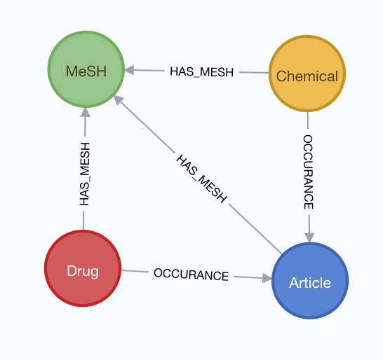

# Neo4j and Cypher Notes

## Creating Drug/Chemical Co-Occurrence Graph
- Data on occurance of drugs/chemicals in pubmed abstracts imported
  - generated in section detailed in elasticsearch document

Python neo4j-driver used to create a graph data base with the schema:



## Querying Reactome in Cypher

###  Finding gene products associated with cellular response to oxidative stress

```
MATCH (gt:GO_Term{accession: "0034599"})-[:goBiologicalProcess]-(p:Pathway)-[]-(r:Reaction)-[]-(ge:GenomeEncodedEntity)
WHERE ge.speciesName = "Homo sapiens"
RETURN DISTINCT ge.displayName
LIMIT 10
```
#### Results
"2xHC-TXN2 [mitochondrial matrix]"  
"TXN [cytosol]"   
"P4HB [endoplasmic reticulum lumen]"  
"2xHC-TXN [cytosol]"  
"HC53,56-P4HB [endoplasmic reticulum lumen]"  
"TXN2 [mitochondrial matrix]"  

###  Finding gene products associated with cardiovascular system disease

```
MATCH (d:Disease)-[]-(p:PhysicalEntity)
WHERE toLower(toString(d.displayName)) CONTAINS 'card'
OR toLower(toString(d.displayName)) CONTAINS 'vasc'
RETURN d.displayName, size((d)--(:Drug)) as Drugs, size((d)--(:GenomeEncodedEntity)) as GeneEntities,  count(p) AS PhysicalEntityCount, size((d)--(:PhysicalEntity)--(:Disease)) as PEAssocDisease, size((d)--(:PhysicalEntity)--(:ReactionLikeEvent)) as PEAssocReactLike, size((d)--(:PhysicalEntity)--(:GenomeEncodedEntity)) as PEAssocGeneEntities
ORDER BY PhysicalEntityCount DESC
```
#### Results

|d.displayName  |Drugs|GeneEntities|PhysicalEntityCount|
|---------------|-----|------------|-------------------|
|"cardiofaciocutaneous syndrome"|0|23 |34|
|"myocardial infarction" |20 |0|20|
|"basal ganglia cerebrovascular disease" |0|6|7|
|"cerebrovascular disease" |5|0|5|

